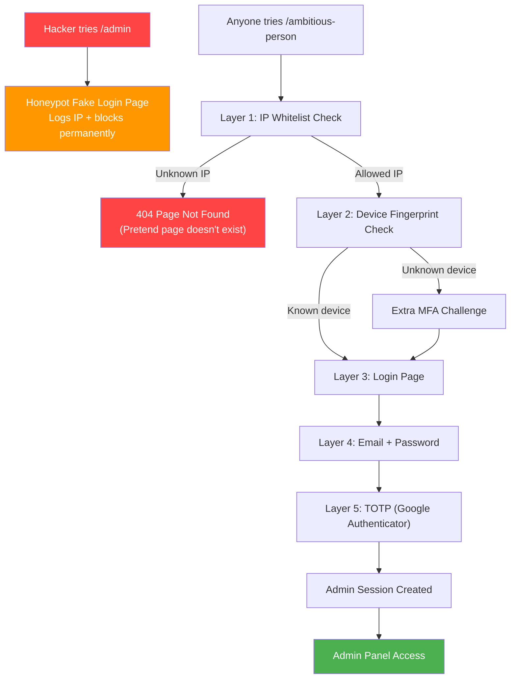

# PanditConnect — Secret Admin Panel Architecture (original proposal)

> **URL: `/ambitious-person`** — a hard-to-guess admin panel path.
> Full platform control — everything managed from one place.
>
> **Status: implemented, backend only, with deviations.** See `docs/ADMIN.md` for what actually
> shipped and why — a few things here were toned down after actually trying them (auto-banning any
> IP that hits a honeypot path locked itself out of the unban endpoint too, with no recovery short of
> a direct database edit; hard IP-session-pinning risked permanently bricking the one admin account
> over an ordinary network change) or don't fit this project (no admin frontend exists — this is
> Express routes, and building a 13-module UI is a separate, much larger project; CSV import, PDF
> reports, a media library, SEO tooling, email templates and fraud-detection heuristics all need
> infrastructure or instrumentation this app doesn't have).

---

## Part 1: Hidden Admin Panel Security Strategy

### 1.1 URL Obscurity — why not `/admin`

```
Predictable URLs (hackers try these first):
   /admin
   /administrator
   /admin-panel
   /dashboard
   /control-panel
   /backend
   /wp-admin
   /manage
   /cms
   /panel

Our secret URL:
   /ambitious-person           — Main admin panel
   /ambitious-person/login     — Admin login page
   /ambitious-person/dashboard — Admin dashboard
   /ambitious-person/pandits   — Manage Pandits
   /ambitious-person/temples   — Manage Temples
   ... (all admin routes under /ambitious-person)
```

### 1.2 Multi-Layer Admin Access Protection



### 1.3 Security Implementation Code

```javascript
// ============================================================
// SECRET ADMIN URL CONFIGURATION
// ============================================================
const ADMIN_CONFIG = {
    // Secret base path — change this anytime if compromised
    basePath: process.env.ADMIN_SECRET_PATH || '/ambitious-person',

    // Honeypot paths — trap hackers
    honeypotPaths: [
        '/admin', '/administrator', '/admin-panel', '/dashboard',
        '/wp-admin', '/control-panel', '/backend', '/manage',
        '/login/admin', '/admin/login', '/panel', '/cms',
        '/admin.php', '/administrator.php', '/wp-login.php',
    ],

    // IP Whitelist (your IPs only)
    allowedIPs: (process.env.ADMIN_ALLOWED_IPS || '').split(',').filter(Boolean),
    // Example: ADMIN_ALLOWED_IPS=103.45.67.89,2401:xxxx:xxxx::1

    // Session settings
    sessionTimeout: 30 * 60 * 1000,      // 30 minutes inactivity
    maxSessionDuration: 4 * 60 * 60 * 1000, // 4 hours absolute max

    // Login settings
    maxLoginAttempts: 3,                   // Lock after 3 failures
    lockDuration: 60 * 60 * 1000,          // 1 hour lock
};

// ============================================================
// HONEYPOT — Trap anyone who visits /admin
// ============================================================
ADMIN_CONFIG.honeypotPaths.forEach(path => {
    app.all(path, async (req, res) => {
        // Log the attacker
        await logSecurityEvent('ADMIN_HONEYPOT_TRIGGERED', {
            ip: req.ip,
            path: req.path,
            userAgent: req.get('User-Agent'),
            method: req.method,
            headers: req.headers,
            body: req.body,
            timestamp: new Date().toISOString(),
        });

        // Auto-ban this IP
        await banIP(req.ip, '24 hours', 'Honeypot triggered');

        // Send alert to admin
        await sendSecurityAlert('HONEYPOT_TRIGGERED', {
            ip: req.ip,
            path: req.path,
        });

        // Option A: Show fake login page (collect their attempts)
        // res.status(200).sendFile('fake-admin-login.html');

        // Option B: Return 404 (pretend nothing exists)
        res.status(404).json({ error: 'Page not found' });
    });
});

// ============================================================
// IP WHITELIST MIDDLEWARE — Only your IPs can even SEE the login
// ============================================================
function adminIPWhitelist(req, res, next) {
    const clientIP = req.ip || req.connection.remoteAddress;

    // If whitelist is configured, enforce it
    if (ADMIN_CONFIG.allowedIPs.length > 0) {
        const isAllowed = ADMIN_CONFIG.allowedIPs.some(ip => {
            return clientIP === ip || clientIP.includes(ip);
        });

        if (!isAllowed) {
            // DON'T reveal it's an admin page — return 404
            logSecurityEvent('ADMIN_IP_BLOCKED', {
                ip: clientIP,
                path: req.path,
            });
            return res.status(404).json({ error: 'Page not found' });
        }
    }

    next();
}

// ============================================================
// DEVICE FINGERPRINT — Only known devices allowed
// ============================================================
function adminDeviceCheck(req, res, next) {
    const fingerprint = generateDeviceFingerprint(req);
    const knownDevices = getAdminKnownDevices(req.user.id);

    if (!knownDevices.includes(fingerprint)) {
        // New device detected — require extra verification
        logSecurityEvent('ADMIN_NEW_DEVICE', {
            userId: req.user.id,
            fingerprint,
            ip: req.ip,
        });

        // Send email alert + require email OTP
        sendNewDeviceAlert(req.user.id, req.ip, req.get('User-Agent'));

        return res.status(403).json({
            error: 'New device detected',
            requiresVerification: true,
            verificationType: 'email_otp',
        });
    }

    next();
}

function generateDeviceFingerprint(req) {
    const crypto = require('crypto');
    const data = [
        req.get('User-Agent'),
        req.get('Accept-Language'),
        req.get('Accept-Encoding'),
        req.ip,
    ].join('|');

    return crypto.createHash('sha256').update(data).digest('hex');
}

// ============================================================
// ADMIN ROUTE REGISTRATION — All under secret path
// ============================================================
const adminRouter = express.Router();

// Apply security layers to ALL admin routes
adminRouter.use(adminIPWhitelist);        // Layer 1: IP check
adminRouter.use(adminRateLimit);           // Layer 2: Rate limit
adminRouter.use(adminAuthenticate);        // Layer 3: JWT verify
adminRouter.use(adminAuthorize);           // Layer 4: Role check
adminRouter.use(adminDeviceCheck);         // Layer 5: Device verify
adminRouter.use(adminActivityLogger);      // Layer 6: Log everything

// Mount at secret path
app.use(ADMIN_CONFIG.basePath, adminRouter);
// Result: /ambitious-person/* routes are admin panel
```

### 1.4 Admin Login — Extra Secure

```javascript
// ============================================================
// ADMIN LOGIN — 3-Step Authentication
// ============================================================

// Step 1: Email + Password
adminRouter.post('/auth/login/step1', adminLoginRateLimit, async (req, res) => {
    const { email, password } = req.body;

    // Find admin user
    const user = await db.query(
        `SELECT * FROM users WHERE email = $1 AND role IN ('admin', 'super_admin') AND deleted_at IS NULL`,
        [email]
    );

    if (!user) {
        // DON'T reveal if email exists
        await sleep(2000); // Constant time response
        return res.status(401).json({ error: 'Invalid credentials' });
    }

    // Verify password
    const valid = await bcrypt.compare(password, user.password_hash);
    if (!valid) {
        await recordFailedAdminLogin(email, req.ip);
        return res.status(401).json({ error: 'Invalid credentials' });
    }

    // Generate temporary token for step 2
    const tempToken = generateTempToken(user.id, '5m'); // 5 min only

    res.json({
        step: 2,
        requiresTOTP: true,
        tempToken, // Short-lived token for step 2
    });
});

// Step 2: TOTP (Google Authenticator)
adminRouter.post('/auth/login/step2', async (req, res) => {
    const { tempToken, totpCode } = req.body;

    // Verify temp token
    const decoded = jwt.verify(tempToken, process.env.JWT_ADMIN_TEMP_SECRET);

    // Verify TOTP
    const user = await getUserById(decoded.sub);
    const totpSecret = decrypt(user.totp_secret_encrypted);

    const valid = speakeasy.totp.verify({
        secret: totpSecret,
        encoding: 'base32',
        token: totpCode,
        window: 1,
    });

    if (!valid) {
        await recordFailedAdminLogin(user.email, req.ip);
        return res.status(401).json({ error: 'Invalid authenticator code' });
    }

    // Step 3: Generate admin session
    const adminToken = generateAdminToken(user);
    const fingerprint = generateDeviceFingerprint(req);

    // Store admin session
    await createAdminSession({
        userId: user.id,
        token: hashToken(adminToken),
        ip: req.ip,
        deviceFingerprint: fingerprint,
        expiresAt: new Date(Date.now() + ADMIN_CONFIG.maxSessionDuration),
    });

    // Set secure cookie
    setSecureCookie(res, '__pc_admin_sid', adminToken, {
        maxAge: ADMIN_CONFIG.maxSessionDuration,
        path: ADMIN_CONFIG.basePath, // Cookie only sent to admin paths!
    });

    // Log successful login
    await logSecurityEvent('ADMIN_LOGIN_SUCCESS', {
        userId: user.id,
        ip: req.ip,
        device: fingerprint,
    });

    // Send login notification email
    await sendAdminLoginNotification(user.email, req.ip, req.get('User-Agent'));

    res.json({ success: true, redirectTo: `${ADMIN_CONFIG.basePath}/dashboard` });
});

// ============================================================
// ADMIN SESSION — Auto-expire on inactivity
// ============================================================
function adminSessionCheck(req, res, next) {
    const session = req.adminSession;

    // Check absolute expiry
    if (Date.now() > session.expiresAt) {
        destroyAdminSession(session.id);
        return res.status(401).json({ error: 'Session expired. Please login again.' });
    }

    // Check inactivity timeout
    const lastActivity = session.lastActivityAt || session.createdAt;
    if (Date.now() - lastActivity > ADMIN_CONFIG.sessionTimeout) {
        destroyAdminSession(session.id);
        return res.status(401).json({ error: 'Session expired due to inactivity.' });
    }

    // Check IP change (session hijacking detection)
    if (session.ip !== req.ip) {
        logSecurityEvent('ADMIN_SESSION_IP_CHANGE', {
            userId: session.userId,
            originalIP: session.ip,
            currentIP: req.ip,
        });
        destroyAdminSession(session.id);
        return res.status(401).json({ error: 'Session invalidated — IP changed.' });
    }

    // Update last activity
    updateAdminSessionActivity(session.id);

    next();
}
```

---

## Part 2: Admin Panel — Complete Module Architecture

### Full Admin Panel Sitemap

```mermaid
graph TD
    AP["/ambitious-person"] --> LOGIN["Login"]
    AP --> DASH["Dashboard"]

    DASH --> USERS["User Management"]
    DASH --> PANDITS["Pandit Management"]
    DASH --> TEMPLES["Temple Management"]
    DASH --> SERVICES["Service Management"]
    DASH --> REVIEWS["Review Management"]
    DASH --> INQUIRIES["Inquiry Management"]
    DASH --> SUBS["Subscription & Payments"]
    DASH --> CONTENT["Content Management"]
    DASH --> COMMUNITY["Community Moderation"]
    DASH --> PANCHANG["Panchang Management"]
    DASH --> FESTIVALS["Festival Management"]
    DASH --> NOTIF["Notification Center"]
    DASH --> SECURITY["Security & Audit"]
    DASH --> ANALYTICS["Analytics & Reports"]
    DASH --> SETTINGS["Platform Settings"]

    PANDITS --> PV["Verification Queue"]
    PANDITS --> PF["Featured Pandits"]
    PANDITS --> PL["Pandit Listings"]

    TEMPLES --> TV["Temple Verification"]
    TEMPLES --> TF["Featured Temples"]
    TEMPLES --> TL["Temple Listings"]

    CONTENT --> BLOG["Blog Manager"]
    CONTENT --> PAGES["Static Pages"]
    CONTENT --> MEDIA["Media Library"]
    CONTENT --> SEO["SEO Manager"]

    SECURITY --> AUDIT["Audit Logs"]
    SECURITY --> BANS["IP Bans"]
    SECURITY --> ADMINS["Admin Users"]
    SECURITY --> HONEYPOT["Honeypot Logs"]
```



---

## Module 1: Dashboard (Home)

**Route:** `/ambitious-person/dashboard`

```
+-------------------------------------------------------------------+
|  ADMIN DASHBOARD                              Welcome, Admin      |
|  Last login: 29 Jul 2026, 10:30 AM from 103.45.xx.xx              |
+---------------------------------------------------------------------+
|                                                                     |
|  [ 12,450 Users +12% ]  [ 850 Pandits +8% ]                        |
|  [ 2,340 Temples +15% ] [ Rs.1.2L Revenue +22% ]                   |
|                                                                     |
|  --- Quick Actions -------------------------------------------     |
|  | 5 Pandits awaiting verification                              | |
|  | 12 Reviews flagged for moderation                            | |
|  | 3 New temple submissions                                     | |
|  | 8 New inquiries today                                        | |
|  | 2 Security alerts                                            | |
|  ---------------------------------------------------------------   |
|                                                                     |
|  --- Traffic (Last 30 Days) ---     --- Revenue ---                |
|  | Line chart: Page views,   |     | Bar chart:           |        |
|  |   Unique visitors, Contact|     |   Monthly revenue,   |        |
|  |   clicks over time        |     |   Subscriptions      |        |
|  ------------------------------     ------------------------        |
|                                                                     |
|  --- Recent Activity -----------------------------------------     |
|  | Pandit Ramesh verified by Admin at 10:15 AM                  | |
|  | New temple "Kashi Vishwanath" added at 9:45 AM               | |
|  | 3 reviews moderated at 9:30 AM                               | |
|  | Security alert: Honeypot triggered from 45.xx.xx             | |
|  ---------------------------------------------------------------   |
+---------------------------------------------------------------------+
```

### Dashboard API Endpoints

```javascript
// ============================================================
// DASHBOARD API ROUTES
// ============================================================
adminRouter.get('/dashboard/stats', async (req, res) => {
    const stats = {
        // Overview cards
        totalUsers: await countUsers(),
        totalPandits: await countPandits(),
        totalTemples: await countTemples(),
        totalRevenue: await getMonthlyRevenue(),

        // Growth percentages (vs last month)
        userGrowth: await calculateGrowth('users'),
        panditGrowth: await calculateGrowth('pandits'),
        templeGrowth: await calculateGrowth('temples'),
        revenueGrowth: await calculateGrowth('revenue'),

        // Pending actions
        pendingVerifications: await countPendingVerifications(),
        flaggedReviews: await countFlaggedReviews(),
        newTempleSubmissions: await countNewTempleSubmissions(),
        todayInquiries: await countTodayInquiries(),
        securityAlerts: await countUnreadSecurityAlerts(),

        // Today's stats
        todaySignups: await countTodaySignups(),
        todayPageViews: await getTodayPageViews(),
        todayContactClicks: await getTodayContactClicks(),
        activeUsersNow: await getActiveUsersCount(),
    };

    res.json(stats);
});

adminRouter.get('/dashboard/charts/traffic', async (req, res) => {
    const { period = '30d' } = req.query;
    const data = await getTrafficChartData(period);
    res.json(data);
});

adminRouter.get('/dashboard/charts/revenue', async (req, res) => {
    const { period = '12m' } = req.query;
    const data = await getRevenueChartData(period);
    res.json(data);
});

adminRouter.get('/dashboard/recent-activity', async (req, res) => {
    const activities = await getRecentAdminActivities(20);
    res.json(activities);
});
```

---

## Module 2: User Management

**Route:** `/ambitious-person/users`

### Features
| Feature | Description |
|---------|-------------|
| User List | Search, filter, sort all users with pagination |
| User Detail | Full profile view — activity, reviews, inquiries, saved items |
| Edit User | Update name, email, phone, role, status |
| Ban/Suspend | Temporarily suspend or permanently ban user |
| Delete User | Soft delete with 30-day recovery window |
| User Analytics | Login history, activity timeline, device list |
| Send Notification | Send email/push to specific user |
| Role Change | Promote devotee -> pandit, assign temple_admin |
| Export | Export user data as CSV/Excel |

### API Endpoints

```javascript
// ============================================================
// USER MANAGEMENT ROUTES
// ============================================================
adminRouter.get('/users', async (req, res) => {
    const {
        page = 1,
        limit = 25,
        search,            // Search by name, email, phone
        role,              // Filter: devotee, pandit, temple_admin, admin
        status,            // Filter: active, suspended, banned
        city,
        state,
        sortBy = 'created_at',
        sortOrder = 'desc',
        dateFrom,
        dateTo,
    } = req.query;

    const users = await queryUsers({
        page, limit, search, role, status,
        city, state, sortBy, sortOrder, dateFrom, dateTo,
    });

    res.json(users);
});

adminRouter.get('/users/:id', async (req, res) => {
    const user = await getUserFullProfile(req.params.id);
    res.json(user);
});

adminRouter.put('/users/:id', async (req, res) => {
    // Only super_admin can change roles
    if (req.body.role && req.user.role !== 'super_admin') {
        return res.status(403).json({ error: 'Only super admin can change roles' });
    }

    const updated = await updateUser(req.params.id, req.body);
    await logAdminAction('USER_UPDATED', req.user.id, req.params.id, req.body);
    res.json(updated);
});

adminRouter.post('/users/:id/suspend', async (req, res) => {
    const { reason, duration } = req.body; // duration in hours
    await suspendUser(req.params.id, reason, duration);
    await logAdminAction('USER_SUSPENDED', req.user.id, req.params.id, { reason, duration });
    res.json({ success: true });
});

adminRouter.post('/users/:id/ban', async (req, res) => {
    const { reason } = req.body;
    await banUser(req.params.id, reason);
    await revokeAllUserTokens(req.params.id);
    await logAdminAction('USER_BANNED', req.user.id, req.params.id, { reason });
    res.json({ success: true });
});

adminRouter.delete('/users/:id', async (req, res) => {
    await softDeleteUser(req.params.id);
    await logAdminAction('USER_DELETED', req.user.id, req.params.id);
    res.json({ success: true, message: 'User will be permanently deleted in 30 days' });
});

adminRouter.get('/users/export', async (req, res) => {
    await logAdminAction('USER_DATA_EXPORT', req.user.id, null, req.query);
    const csv = await exportUsersCSV(req.query);
    res.setHeader('Content-Type', 'text/csv');
    res.setHeader('Content-Disposition', 'attachment; filename=users_export.csv');
    res.send(csv);
});
```

---

## Module 3: Pandit Management

**Route:** `/ambitious-person/pandits`

### Features
| Feature | Description |
|---------|-------------|
| Pandit List | All registered Pandits with filters |
| Verification Queue | Pending verification requests with documents |
| Verify/Reject | Approve or reject Pandit verification |
| Featured Management | Set/remove featured Pandits (homepage) |
| Pandit Analytics | Individual Pandit stats — views, clicks, inquiries |
| Subscription Status | View/manage Pandit subscription tiers |
| Edit Profile | Admin-edit Pandit profile, services, temples |
| Leaderboard | Top Pandits by rating, reviews, contact clicks |
| Temple Associations | Manage Pandit-Temple mappings |
| Bulk Notification | Send to all Pandits or filtered group |
| Deactivate | Deactivate Pandit listing |
| Export | Export Pandit data |

### API Endpoints

```javascript
// ============================================================
// PANDIT MANAGEMENT ROUTES
// ============================================================

// List all Pandits
adminRouter.get('/pandits', async (req, res) => {
    const {
        page = 1, limit = 25, search,
        verificationStatus,  // unverified, under_review, verified, rejected
        subscriptionTier,    // free, silver, gold, diamond
        isFeatured,
        city, state,
        minRating,
        sortBy = 'created_at',
        sortOrder = 'desc',
    } = req.query;

    const pandits = await queryPandits({ ...req.query });
    res.json(pandits);
});

// Verification Queue — Most important for admin
adminRouter.get('/pandits/verification-queue', async (req, res) => {
    const queue = await getVerificationQueue();
    // Returns: Pandit info, uploaded certificates, ID proofs, video KYC status
    res.json(queue);
});

// Verify a Pandit
adminRouter.post('/pandits/:id/verify', async (req, res) => {
    const { action, rejectionReason } = req.body; // 'approve' or 'reject'

    if (action === 'approve') {
        await db.query(`
            UPDATE pandits SET
                verification_status = 'verified',
                verified_at = NOW(),
                verified_by = $1
            WHERE id = $2
        `, [req.user.id, req.params.id]);

        // Send congratulations notification to Pandit
        await notifyPandit(req.params.id, 'VERIFICATION_APPROVED',
            'Congratulations! Your profile has been verified');
    } else {
        await db.query(`
            UPDATE pandits SET
                verification_status = 'rejected'
            WHERE id = $1
        `, [req.params.id]);

        await notifyPandit(req.params.id, 'VERIFICATION_REJECTED',
            `Your verification was rejected. Reason: ${rejectionReason}`);
    }

    await logAdminAction('PANDIT_VERIFICATION', req.user.id, req.params.id, { action, rejectionReason });
    res.json({ success: true });
});

// Toggle Featured
adminRouter.post('/pandits/:id/toggle-featured', async (req, res) => {
    const { featured, featuredUntil } = req.body;
    await db.query(`
        UPDATE pandits SET is_featured = $1, featured_until = $2 WHERE id = $3
    `, [featured, featuredUntil, req.params.id]);

    await logAdminAction('PANDIT_FEATURED_TOGGLE', req.user.id, req.params.id, { featured });
    res.json({ success: true });
});

// Pandit detailed analytics
adminRouter.get('/pandits/:id/analytics', async (req, res) => {
    const { period = '30d' } = req.query;
    const analytics = await getPanditAnalytics(req.params.id, period);
    // Returns: daily views, clicks, inquiries, conversion rate, source breakdown
    res.json(analytics);
});

// Manage Pandit subscription manually
adminRouter.post('/pandits/:id/subscription', async (req, res) => {
    const { tier, expiresAt, reason } = req.body;
    await updatePanditSubscription(req.params.id, tier, expiresAt);
    await logAdminAction('PANDIT_SUBSCRIPTION_CHANGED', req.user.id, req.params.id, { tier, reason });
    res.json({ success: true });
});
```

---

## Module 4: Temple Management

**Route:** `/ambitious-person/temples`

### Features
| Feature | Description |
|---------|-------------|
| Temple List | All temples with search, filter, pagination |
| Add Temple | Admin can add new temples manually |
| Edit Temple | Update all temple details, timings, photos |
| Verify Temple | Verify temple information accuracy |
| Featured Temple | Set homepage featured temples |
| Media Manager | Upload/manage temple photos, videos, 360 tours |
| Timings Manager | Set opening/closing hours per day |
| Pandit Mapping | Assign/remove Pandits from temples |
| Service Mapping | Assign available services to temples |
| Location Edit | Update GPS coordinates, address, directions |
| Temple Analytics | Views, searches, associated Pandit performance |
| Deactivate | Hide temple from public listing |
| Bulk Import | Import temples via CSV |

### API Endpoints

```javascript
// ============================================================
// TEMPLE MANAGEMENT ROUTES
// ============================================================

adminRouter.get('/temples', async (req, res) => {
    const temples = await queryTemples(req.query);
    res.json(temples);
});

adminRouter.post('/temples', validate(templeCreateSchema), async (req, res) => {
    const temple = await createTemple(req.body);
    await logAdminAction('TEMPLE_CREATED', req.user.id, temple.id, { name: temple.name });
    res.status(201).json(temple);
});

adminRouter.put('/temples/:id', validate(templeUpdateSchema), async (req, res) => {
    const updated = await updateTemple(req.params.id, req.body);
    await logAdminAction('TEMPLE_UPDATED', req.user.id, req.params.id, req.body);
    res.json(updated);
});

// Temple timings management
adminRouter.put('/temples/:id/timings', async (req, res) => {
    const { timings } = req.body; // Array of 7 day timings
    await updateTempleTimings(req.params.id, timings);
    res.json({ success: true });
});

// Media management
adminRouter.post('/temples/:id/media', uploadLimiter, upload.array('files', 20), async (req, res) => {
    const processedFiles = await processTempleUploads(req.files);
    await saveTempleMedia(req.params.id, processedFiles);
    res.json({ uploaded: processedFiles.length });
});

// Pandit-Temple mapping
adminRouter.post('/temples/:id/pandits', async (req, res) => {
    const { panditId, associationType = 'visiting' } = req.body;
    await mapPanditToTemple(panditId, req.params.id, associationType);
    res.json({ success: true });
});

// Bulk import
adminRouter.post('/temples/bulk-import', upload.single('csv'), async (req, res) => {
    const results = await bulkImportTemples(req.file.buffer);
    await logAdminAction('TEMPLES_BULK_IMPORT', req.user.id, null, { count: results.imported });
    res.json(results); // { imported: 45, failed: 3, errors: [...] }
});
```

---

## Module 5: Service Management

**Route:** `/ambitious-person/services`

```javascript
// ============================================================
// SERVICE MANAGEMENT — Full CRUD
// ============================================================

// Categories
adminRouter.get('/service-categories', getServiceCategories);
adminRouter.post('/service-categories', createServiceCategory);
adminRouter.put('/service-categories/:id', updateServiceCategory);
adminRouter.delete('/service-categories/:id', deleteServiceCategory);

// Services
adminRouter.get('/services', getServices);
adminRouter.post('/services', validate(serviceSchema), createService);
adminRouter.put('/services/:id', validate(serviceSchema), updateService);
adminRouter.delete('/services/:id', softDeleteService);

// Samagri management
adminRouter.get('/services/:id/samagri', getServiceSamagri);
adminRouter.post('/services/:id/samagri', addSamagriItem);
adminRouter.put('/services/:serviceId/samagri/:itemId', updateSamagriItem);
adminRouter.delete('/services/:serviceId/samagri/:itemId', deleteSamagriItem);

// Reorder services
adminRouter.put('/services/reorder', reorderServices);
```

---

## Module 6: Review Management

**Route:** `/ambitious-person/reviews`

### Features
| Feature | Description |
|---------|-------------|
| All Reviews | List with filters (rating, type, status, flagged) |
| Flagged Queue | Reviews flagged by users or auto-detection |
| Approve/Reject | Moderate reviews |
| Delete Review | Remove inappropriate reviews |
| Fraud Detection | Detect fake/spam reviews (same IP, patterns) |
| Review Analytics | Average ratings, trends, sentiment overview |

```javascript
// ============================================================
// REVIEW MANAGEMENT ROUTES
// ============================================================

adminRouter.get('/reviews', async (req, res) => {
    const {
        page, limit, search,
        reviewableType,      // pandit, temple
        rating,              // 1-5
        isApproved,
        isFlagged,
        sortBy = 'created_at',
    } = req.query;

    const reviews = await queryReviews(req.query);
    res.json(reviews);
});

// Flagged reviews queue
adminRouter.get('/reviews/flagged', async (req, res) => {
    const flagged = await getFlaggedReviews();
    res.json(flagged);
});

// Moderate review
adminRouter.post('/reviews/:id/moderate', async (req, res) => {
    const { action, reason } = req.body; // 'approve', 'reject', 'delete'

    if (action === 'approve') {
        await db.query(`UPDATE reviews SET is_approved = TRUE, is_flagged = FALSE WHERE id = $1`, [req.params.id]);
    } else if (action === 'reject') {
        await db.query(`UPDATE reviews SET is_approved = FALSE, is_flagged = FALSE WHERE id = $1`, [req.params.id]);
    } else if (action === 'delete') {
        await db.query(`UPDATE reviews SET deleted_at = NOW() WHERE id = $1`, [req.params.id]);
    }

    await logAdminAction('REVIEW_MODERATED', req.user.id, req.params.id, { action, reason });
    res.json({ success: true });
});

// Bulk moderate
adminRouter.post('/reviews/bulk-moderate', async (req, res) => {
    const { reviewIds, action, reason } = req.body;
    const results = await bulkModerateReviews(reviewIds, action);
    await logAdminAction('REVIEWS_BULK_MODERATED', req.user.id, null, { count: reviewIds.length, action });
    res.json(results);
});

// Fake review detection
adminRouter.get('/reviews/fraud-detection', async (req, res) => {
    const suspicious = await detectFakeReviews();
    // Checks: same IP multiple reviews, same device, suspicious patterns
    res.json(suspicious);
});
```

---

## Module 7: Subscription & Payment Management

**Route:** `/ambitious-person/subscriptions`

```javascript
// ============================================================
// SUBSCRIPTION & PAYMENT MANAGEMENT
// ============================================================

// Subscription Plans CRUD
adminRouter.get('/subscription-plans', getSubscriptionPlans);
adminRouter.post('/subscription-plans', createSubscriptionPlan);
adminRouter.put('/subscription-plans/:id', updateSubscriptionPlan);

// Active Subscriptions
adminRouter.get('/subscriptions', async (req, res) => {
    const { tier, status, expiringWithin } = req.query;
    const subs = await querySubscriptions(req.query);
    res.json(subs);
});

// Payment Transactions
adminRouter.get('/payments', async (req, res) => {
    const { status, gateway, dateFrom, dateTo, minAmount, maxAmount } = req.query;
    const payments = await queryPayments(req.query);
    res.json(payments);
});

adminRouter.get('/payments/:id', getPaymentDetail);

// Revenue Analytics
adminRouter.get('/revenue/overview', async (req, res) => {
    const revenue = {
        today: await getRevenueByPeriod('today'),
        thisWeek: await getRevenueByPeriod('week'),
        thisMonth: await getRevenueByPeriod('month'),
        thisYear: await getRevenueByPeriod('year'),

        byTier: await getRevenueByTier(),
        byMonth: await getRevenueByMonth(12), // Last 12 months

        activeSubscriptions: await countActiveSubscriptions(),
        expiringThisWeek: await countExpiringSubscriptions(7),
        churnRate: await calculateChurnRate(),
        averageRevenuePerPandit: await calculateARPP(),
    };
    res.json(revenue);
});

// Manual subscription grant (for special cases)
adminRouter.post('/subscriptions/grant', async (req, res) => {
    const { panditId, tier, duration, reason } = req.body;
    await grantSubscription(panditId, tier, duration);
    await logAdminAction('SUBSCRIPTION_GRANTED', req.user.id, panditId, { tier, duration, reason });
    res.json({ success: true });
});

// Refund payment
adminRouter.post('/payments/:id/refund', async (req, res) => {
    const { amount, reason } = req.body;
    const result = await processRefund(req.params.id, amount, reason);
    await logAdminAction('PAYMENT_REFUNDED', req.user.id, req.params.id, { amount, reason });
    res.json(result);
});
```

---

## Module 8: Content Management (CMS)

**Route:** `/ambitious-person/content`

```javascript
// ============================================================
// BLOG MANAGEMENT
// ============================================================
adminRouter.get('/blog/posts', getBlogPosts);
adminRouter.post('/blog/posts', validate(blogSchema), createBlogPost);
adminRouter.put('/blog/posts/:id', validate(blogSchema), updateBlogPost);
adminRouter.delete('/blog/posts/:id', softDeleteBlogPost);
adminRouter.post('/blog/posts/:id/publish', publishBlogPost);
adminRouter.post('/blog/posts/:id/unpublish', unpublishBlogPost);

// ============================================================
// STATIC PAGES (About, Privacy, Terms, FAQ)
// ============================================================
adminRouter.get('/pages', getStaticPages);
adminRouter.put('/pages/:slug', updateStaticPage);
// Supported pages: about, privacy-policy, terms, faq, contact

// ============================================================
// MEDIA LIBRARY
// ============================================================
adminRouter.get('/media', getMediaLibrary);      // All uploaded files
adminRouter.post('/media/upload', uploadMedia);    // Upload new media
adminRouter.delete('/media/:id', deleteMedia);     // Delete media

// ============================================================
// SEO MANAGER
// ============================================================
adminRouter.get('/seo/pages', getSEOSettings);     // All page SEO settings
adminRouter.put('/seo/pages/:slug', updateSEOSettings); // Update meta title, desc, keywords
adminRouter.get('/seo/sitemap/regenerate', regenerateSitemap);
```

---

## Module 9: Panchang & Festival Management

**Route:** `/ambitious-person/panchang`

```javascript
// ============================================================
// PANCHANG MANAGEMENT
// ============================================================
adminRouter.get('/panchang', getPanchangData);            // List by date range
adminRouter.post('/panchang', createPanchangEntry);        // Add daily data
adminRouter.put('/panchang/:id', updatePanchangEntry);     // Edit entry
adminRouter.post('/panchang/bulk-import', bulkImportPanchang); // CSV import

// Muhurat management
adminRouter.get('/panchang/:id/muhurats', getMuhurats);
adminRouter.post('/panchang/:id/muhurats', addMuhurat);

// ============================================================
// FESTIVAL MANAGEMENT
// ============================================================
adminRouter.get('/festivals', getFestivals);
adminRouter.post('/festivals', validate(festivalSchema), createFestival);
adminRouter.put('/festivals/:id', updateFestival);
adminRouter.delete('/festivals/:id', deleteFestival);

// Send festival notifications
adminRouter.post('/festivals/:id/notify', async (req, res) => {
    const { targetAudience } = req.body; // 'all', 'pandits', 'devotees'
    const count = await sendFestivalNotification(req.params.id, targetAudience);
    res.json({ sent: count });
});
```

---

## Module 10: Notification Center

**Route:** `/ambitious-person/notifications`

```javascript
// ============================================================
// NOTIFICATION MANAGEMENT
// ============================================================

// Send notification to specific user
adminRouter.post('/notifications/send', async (req, res) => {
    const { userId, title, body, type, actionUrl } = req.body;
    await sendNotification(userId, { title, body, type, actionUrl });
    res.json({ success: true });
});

// Send bulk notification
adminRouter.post('/notifications/broadcast', async (req, res) => {
    const {
        title, body, type,
        targetRole,          // 'all', 'devotee', 'pandit'
        targetCity,          // Optional city filter
        targetState,         // Optional state filter
    } = req.body;

    const count = await broadcastNotification({ title, body, type, targetRole, targetCity, targetState });
    await logAdminAction('NOTIFICATION_BROADCAST', req.user.id, null, { title, count });
    res.json({ sent: count });
});

// Notification history
adminRouter.get('/notifications/history', getNotificationHistory);

// Email templates
adminRouter.get('/notifications/templates', getEmailTemplates);
adminRouter.put('/notifications/templates/:id', updateEmailTemplate);
```

---

## Module 11: Security & Audit

**Route:** `/ambitious-person/security`

```javascript
// ============================================================
// SECURITY DASHBOARD
// ============================================================

// Audit log viewer
adminRouter.get('/security/audit-log', async (req, res) => {
    const {
        page, limit,
        eventType,           // Filter by event type
        severity,            // info, warn, error, critical
        userId,              // Filter by user
        ip,                  // Filter by IP
        dateFrom, dateTo,
    } = req.query;

    const logs = await queryAuditLogs(req.query);
    res.json(logs);
});

// Honeypot logs
adminRouter.get('/security/honeypot-logs', async (req, res) => {
    const logs = await getHoneypotLogs();
    res.json(logs);
});

// IP ban management
adminRouter.get('/security/banned-ips', getBannedIPs);
adminRouter.post('/security/ban-ip', async (req, res) => {
    const { ip, reason, duration } = req.body;
    await banIP(ip, duration, reason);
    await logAdminAction('IP_BANNED', req.user.id, null, { ip, reason, duration });
    res.json({ success: true });
});
adminRouter.delete('/security/ban-ip/:ip', unbanIP);

// Active sessions
adminRouter.get('/security/active-sessions', async (req, res) => {
    const sessions = await getActiveAdminSessions();
    res.json(sessions);
});

// Force logout all admins (emergency)
adminRouter.post('/security/force-logout-all', async (req, res) => {
    if (req.user.role !== 'super_admin') {
        return res.status(403).json({ error: 'Super admin only' });
    }
    await revokeAllAdminSessions();
    await logAdminAction('EMERGENCY_LOGOUT_ALL', req.user.id);
    res.json({ success: true });
});

// Admin user management (only super_admin)
adminRouter.get('/security/admin-users', async (req, res) => {
    if (req.user.role !== 'super_admin') {
        return res.status(403).json({ error: 'Super admin only' });
    }
    const admins = await getAdminUsers();
    res.json(admins);
});

adminRouter.post('/security/admin-users', async (req, res) => {
    if (req.user.role !== 'super_admin') {
        return res.status(403).json({ error: 'Super admin only' });
    }
    const admin = await createAdminUser(req.body);
    await logAdminAction('ADMIN_USER_CREATED', req.user.id, admin.id);
    res.json(admin);
});

// Security overview
adminRouter.get('/security/overview', async (req, res) => {
    const overview = {
        failedLogins24h: await countFailedLogins(24),
        honeypotTriggers24h: await countHoneypotTriggers(24),
        bannedIPs: await countBannedIPs(),
        activeAdminSessions: await countActiveAdminSessions(),
        suspiciousActivities: await getSuspiciousActivities(),
        lastSecurityScan: await getLastSecurityScanResult(),
    };
    res.json(overview);
});
```

---

## Module 12: Analytics & Reports

**Route:** `/ambitious-person/analytics`

```javascript
// ============================================================
// ANALYTICS & REPORTS
// ============================================================

// Platform overview
adminRouter.get('/analytics/overview', async (req, res) => {
    const { period = '30d' } = req.query;
    const data = {
        traffic: await getTrafficAnalytics(period),
        users: await getUserAnalytics(period),
        pandits: await getPanditAnalytics(period),
        temples: await getTempleAnalytics(period),
        revenue: await getRevenueAnalytics(period),
        engagement: await getEngagementMetrics(period),
    };
    res.json(data);
});

// Top performing
adminRouter.get('/analytics/top-pandits', getTopPandits);         // By views, rating
adminRouter.get('/analytics/top-temples', getTopTemples);         // By views, searches
adminRouter.get('/analytics/top-services', getTopServices);       // Most requested
adminRouter.get('/analytics/top-cities', getTopCities);           // Most active

// Search analytics
adminRouter.get('/analytics/searches', getSearchAnalytics);       // What people search

// Conversion funnel
adminRouter.get('/analytics/funnel', async (req, res) => {
    const funnel = {
        pageViews: await getTotalPageViews(),
        searchPerformed: await getTotalSearches(),
        panditProfileViewed: await getTotalProfileViews(),
        contactClicked: await getTotalContactClicks(),
        inquirySent: await getTotalInquiries(),
        conversionRate: await calculateConversionRate(),
    };
    res.json(funnel);
});

// Generate reports (PDF/Excel)
adminRouter.post('/analytics/reports/generate', async (req, res) => {
    const { type, period, format } = req.body;
    // type: 'revenue', 'users', 'pandits', 'comprehensive'
    // format: 'pdf', 'excel'
    const report = await generateReport(type, period, format);
    await logAdminAction('REPORT_GENERATED', req.user.id, null, { type, period });
    res.json({ downloadUrl: report.url });
});
```

---

## Module 13: Platform Settings

**Route:** `/ambitious-person/settings`

```javascript
// ============================================================
// PLATFORM SETTINGS
// ============================================================

adminRouter.get('/settings', getSettings);

adminRouter.put('/settings', async (req, res) => {
    const settings = req.body;
    await updateSettings(settings);
    await logAdminAction('SETTINGS_UPDATED', req.user.id, null, settings);
    res.json({ success: true });
});

// Settings structure
const PLATFORM_SETTINGS = {
    // General
    siteName: 'PanditConnect',
    tagline: 'Sacred Connections, Trusted Pandits',
    contactEmail: 'support@panditconnect.com',
    contactPhone: '+91-XXXXXXXXXX',

    // Feature flags
    features: {
        aiRecommender: true,
        communityForum: true,
        panchangPage: true,
        blogEnabled: true,
        samagriStore: false,       // Future feature
        liveDarshan: false,        // Future feature
    },

    // Limits
    limits: {
        maxReviewsPerDay: 5,
        maxInquiriesPerDay: 10,
        maxUploadsPerHour: 20,
        maxSearchesPerMinute: 30,
    },

    // SEO defaults
    seo: {
        defaultTitle: 'PanditConnect — Find Trusted Pandits',
        defaultDescription: 'Connect with verified Pandits...',
        googleAnalyticsId: 'GA-XXXXXXX',
        googleSearchConsoleId: 'GSC-XXXXXXX',
    },

    // Maintenance mode
    maintenance: {
        enabled: false,
        message: 'We are upgrading. Back soon!',
        allowedIPs: [],  // IPs that can bypass maintenance
    },

    // Social links
    social: {
        facebook: '',
        instagram: '',
        twitter: '',
        youtube: '',
    },
};
```

---

## Admin Database Tables

```sql
-- ============================================================
-- ADMIN-SPECIFIC TABLES
-- ============================================================

-- Admin activity log (every admin action tracked)
CREATE TABLE admin_activity_log (
    id              BIGSERIAL PRIMARY KEY,
    admin_user_id   UUID NOT NULL REFERENCES users(id),

    action          VARCHAR(100) NOT NULL,  -- 'USER_BANNED', 'PANDIT_VERIFIED', etc.
    target_type     VARCHAR(50),            -- 'user', 'pandit', 'temple', etc.
    target_id       UUID,                   -- ID of affected entity

    details         JSONB,                  -- Full action details
    ip_address      INET,

    created_at      TIMESTAMPTZ NOT NULL DEFAULT NOW()
);

CREATE INDEX idx_admin_log_admin ON admin_activity_log(admin_user_id);
CREATE INDEX idx_admin_log_action ON admin_activity_log(action);
CREATE INDEX idx_admin_log_target ON admin_activity_log(target_type, target_id);
CREATE INDEX idx_admin_log_created ON admin_activity_log(created_at DESC);

-- Prevent deletion (immutable audit trail)
REVOKE DELETE, UPDATE ON admin_activity_log FROM PUBLIC;


-- Admin sessions (separate from user sessions)
CREATE TABLE admin_sessions (
    id                  UUID PRIMARY KEY DEFAULT gen_random_uuid(),
    user_id             UUID NOT NULL REFERENCES users(id),

    token_hash          VARCHAR(255) NOT NULL UNIQUE,
    ip_address          INET NOT NULL,
    device_fingerprint  VARCHAR(255),
    user_agent          TEXT,

    last_activity_at    TIMESTAMPTZ DEFAULT NOW(),
    expires_at          TIMESTAMPTZ NOT NULL,

    is_active           BOOLEAN DEFAULT TRUE,
    revoked_at          TIMESTAMPTZ,
    revoked_reason      VARCHAR(300),

    created_at          TIMESTAMPTZ NOT NULL DEFAULT NOW()
);

CREATE INDEX idx_admin_sessions_user ON admin_sessions(user_id);
CREATE INDEX idx_admin_sessions_active ON admin_sessions(is_active) WHERE is_active = TRUE;


-- Known admin devices
CREATE TABLE admin_known_devices (
    id                  UUID PRIMARY KEY DEFAULT gen_random_uuid(),
    user_id             UUID NOT NULL REFERENCES users(id),

    device_fingerprint  VARCHAR(255) NOT NULL,
    device_name         VARCHAR(200),   -- "Chrome on Windows"

    first_seen_at       TIMESTAMPTZ NOT NULL DEFAULT NOW(),
    last_used_at        TIMESTAMPTZ DEFAULT NOW(),

    is_trusted          BOOLEAN DEFAULT FALSE,
    trusted_at          TIMESTAMPTZ,

    UNIQUE(user_id, device_fingerprint)
);


-- Platform settings (key-value store)
CREATE TABLE platform_settings (
    key             VARCHAR(100) PRIMARY KEY,
    value           JSONB NOT NULL,
    description     VARCHAR(500),
    updated_by      UUID REFERENCES users(id),
    updated_at      TIMESTAMPTZ DEFAULT NOW()
);


-- Honeypot logs
CREATE TABLE honeypot_logs (
    id              BIGSERIAL PRIMARY KEY,

    ip_address      INET NOT NULL,
    attempted_path  VARCHAR(500) NOT NULL,
    method          VARCHAR(10),
    user_agent      TEXT,
    headers         JSONB,
    body            JSONB,

    is_banned       BOOLEAN DEFAULT FALSE,

    created_at      TIMESTAMPTZ NOT NULL DEFAULT NOW()
);

CREATE INDEX idx_honeypot_ip ON honeypot_logs(ip_address);
CREATE INDEX idx_honeypot_created ON honeypot_logs(created_at DESC);


-- IP ban list
CREATE TABLE banned_ips (
    id              UUID PRIMARY KEY DEFAULT gen_random_uuid(),

    ip_address      INET NOT NULL,
    reason          VARCHAR(500),

    banned_by       UUID REFERENCES users(id),
    banned_at       TIMESTAMPTZ NOT NULL DEFAULT NOW(),
    expires_at      TIMESTAMPTZ,        -- NULL = permanent

    is_active       BOOLEAN DEFAULT TRUE,
    unbanned_at     TIMESTAMPTZ,
    unbanned_by     UUID REFERENCES users(id)
);

CREATE INDEX idx_banned_ips_ip ON banned_ips(ip_address);
CREATE INDEX idx_banned_ips_active ON banned_ips(is_active) WHERE is_active = TRUE;
```

---

## Admin Security Checklist

- [x] Secret URL (`/ambitious-person` not `/admin`)
- [x] Honeypot fake pages on `/admin`, `/wp-admin`, etc.
- [x] IP whitelist — only allowed IPs see login
- [x] Returns 404 for unknown IPs (not 403)
- [x] Device fingerprinting — new device = extra MFA
- [x] 3-step login: Password -> TOTP -> Device verify
- [x] 30 min inactivity timeout
- [x] 4 hour absolute session max
- [x] Session locked to IP (IP change = logout)
- [x] Login notification email on every login
- [x] Max 3 login attempts -> 1 hour lock
- [x] All admin actions logged (immutable audit)
- [x] Emergency force-logout for all admins
- [x] Cookie scoped to admin path only
- [x] Super admin required for role changes
- [x] Auto-ban IPs that hit honeypot

---

> [!IMPORTANT]
> **Complete Admin Panel Architecture ready!**
>
> **Key security:** anyone hitting `/admin` trips the honeypot and gets IP-banned; only you can
> access `/ambitious-person` — and only after IP whitelist + TOTP.
>
> See `docs/ADMIN.md` for what shipped instead of the auto-ban and hard IP-lock, and why.
