# PanditConnect — PostgreSQL Database Architecture & Design (original proposal)

> **Advanced, scalable, production-ready** database architecture proposal for the PanditConnect
> platform, submitted for review and implemented in `backend/src/db/01-schema.sql`.
>
> **Status: implemented, with deviations.** This is kept as the original design document, not as
> current truth — the schema that actually shipped fixed a few real bugs in the proposal below (a
> trigger that broke on row delete, Row-Level Security policies that would have taken down the public
> directory once actually enforced) and made a couple of deliberate changes to match how this app
> really runs (anonymous enquiries, since there's no login UI yet). See
> `docs/ARCHITECTURE.md` → "The database" for the full list of what changed and why, and
> `backend/src/db/01-schema.sql` for the schema that's actually running.

---

## Part 1: Entity Relationship Diagram (ERD)

```mermaid
erDiagram
    USERS ||--o{ REVIEWS : writes
    USERS ||--o{ INQUIRIES : sends
    USERS ||--o{ SAVED_PANDITS : saves
    USERS ||--o{ SAVED_TEMPLES : saves
    USERS ||--o{ COMMUNITY_POSTS : creates
    USERS ||--o{ COMMUNITY_COMMENTS : writes
    USERS ||--o{ NOTIFICATIONS : receives

    PANDITS ||--|| USERS : "is a"
    PANDITS ||--o{ PANDIT_SERVICES : offers
    PANDITS ||--o{ PANDIT_TEMPLES : "associated with"
    PANDITS ||--o{ PANDIT_LANGUAGES : speaks
    PANDITS ||--o{ PANDIT_CERTIFICATES : has
    PANDITS ||--o{ PANDIT_MEDIA : uploads
    PANDITS ||--o{ REVIEWS : receives
    PANDITS ||--o{ INQUIRIES : receives
    PANDITS ||--|| PANDIT_SUBSCRIPTIONS : subscribes
    PANDITS ||--o{ PANDIT_AVAILABILITY : sets
    PANDITS ||--o{ PANDIT_ANALYTICS : tracks

    TEMPLES ||--o{ PANDIT_TEMPLES : "has pandits"
    TEMPLES ||--o{ TEMPLE_MEDIA : has
    TEMPLES ||--o{ TEMPLE_SERVICES : offers
    TEMPLES ||--o{ REVIEWS : receives
    TEMPLES ||--o{ SAVED_TEMPLES : "saved by"
    TEMPLES ||--|| TEMPLE_TIMINGS : has

    SERVICES ||--o{ PANDIT_SERVICES : "offered by"
    SERVICES ||--o{ TEMPLE_SERVICES : "available at"
    SERVICES ||--o{ SERVICE_SAMAGRI : requires
    SERVICES ||--|| SERVICE_CATEGORIES : "belongs to"

    SUBSCRIPTION_PLANS ||--o{ PANDIT_SUBSCRIPTIONS : "subscribed by"
    SUBSCRIPTION_PLANS ||--o{ PAYMENT_TRANSACTIONS : "paid for"

    FESTIVALS ||--o{ FESTIVAL_ALERTS : triggers
    PANCHANG_DATA ||--o{ MUHURAT_DATA : contains

    BLOG_POSTS ||--o{ BLOG_CATEGORIES : "categorized in"
    BLOG_POSTS ||--o{ BLOG_TAGS : "tagged with"

    AI_RECOMMENDATIONS ||--o{ USERS : "recommended to"
```



---

## Part 2: Custom Types & Enums

```sql
-- ============================================================
-- CUSTOM ENUMS & TYPES
-- ============================================================

-- User roles
CREATE TYPE user_role AS ENUM (
    'devotee',        -- Regular user browsing temples/pandits
    'pandit',         -- Registered Pandit with profile
    'temple_admin',   -- Temple trust administrator
    'admin',          -- Platform admin
    'super_admin'     -- Super admin with full access
);

-- Account status
CREATE TYPE account_status AS ENUM (
    'pending_verification',
    'active',
    'suspended',
    'deactivated',
    'banned'
);

-- Pandit verification status
CREATE TYPE verification_status AS ENUM (
    'unverified',
    'documents_submitted',
    'under_review',
    'verified',
    'rejected'
);

-- Subscription tier
CREATE TYPE subscription_tier AS ENUM (
    'free',
    'silver',
    'gold',
    'diamond'
);

-- Payment status
CREATE TYPE payment_status AS ENUM (
    'pending',
    'completed',
    'failed',
    'refunded',
    'cancelled'
);

-- Media type
CREATE TYPE media_type AS ENUM (
    'photo',
    'video',
    'video_intro',       -- 60-sec pandit intro video
    'certificate',
    'virtual_tour_360',  -- Temple 360 tour
    'thumbnail'
);

-- Contact method
CREATE TYPE contact_method AS ENUM (
    'whatsapp',
    'phone_call',
    'in_app_message',
    'email'
);

-- Review entity type (polymorphic reviews)
CREATE TYPE reviewable_type AS ENUM (
    'pandit',
    'temple'
);

-- Inquiry status
CREATE TYPE inquiry_status AS ENUM (
    'new',
    'seen',
    'replied',
    'completed',
    'expired'
);

-- Content status (blog, community posts)
CREATE TYPE content_status AS ENUM (
    'draft',
    'published',
    'archived',
    'flagged',
    'removed'
);

-- Day of week
CREATE TYPE day_of_week AS ENUM (
    'monday', 'tuesday', 'wednesday', 'thursday',
    'friday', 'saturday', 'sunday'
);

-- Notification type
CREATE TYPE notification_type AS ENUM (
    'festival_alert',
    'new_review',
    'inquiry_received',
    'profile_verified',
    'subscription_expiring',
    'subscription_renewed',
    'featured_placement',
    'system_announcement',
    'panchang_alert'
);
```

---

## Part 3: Complete Table Definitions

### Module 1: User & Authentication

```sql
-- ============================================================
-- 1. USERS (Central user table for all roles)
-- ============================================================
CREATE TABLE users (
    id                  UUID PRIMARY KEY DEFAULT gen_random_uuid(),

    -- Authentication
    email               VARCHAR(255) UNIQUE NOT NULL,
    phone               VARCHAR(15) UNIQUE,
    password_hash       VARCHAR(255) NOT NULL,

    -- Profile basics
    full_name           VARCHAR(150) NOT NULL,
    display_name        VARCHAR(100),
    avatar_url          TEXT,
    role                user_role NOT NULL DEFAULT 'devotee',
    status              account_status NOT NULL DEFAULT 'pending_verification',

    -- Location
    city                VARCHAR(100),
    state               VARCHAR(100),
    pincode             VARCHAR(10),
    latitude            DECIMAL(10, 8),
    longitude           DECIMAL(11, 8),

    -- Preferences
    preferred_language  VARCHAR(20) DEFAULT 'hi',  -- ISO 639-1
    theme_preference    VARCHAR(20) DEFAULT 'light', -- light/dark

    -- Auth metadata
    email_verified      BOOLEAN DEFAULT FALSE,
    phone_verified      BOOLEAN DEFAULT FALSE,
    last_login_at       TIMESTAMPTZ,
    login_count         INTEGER DEFAULT 0,

    -- OAuth
    google_id           VARCHAR(255) UNIQUE,
    facebook_id         VARCHAR(255) UNIQUE,

    -- Timestamps
    created_at          TIMESTAMPTZ NOT NULL DEFAULT NOW(),
    updated_at          TIMESTAMPTZ NOT NULL DEFAULT NOW(),
    deleted_at          TIMESTAMPTZ  -- Soft delete
);

-- Indexes
CREATE INDEX idx_users_email ON users(email);
CREATE INDEX idx_users_phone ON users(phone);
CREATE INDEX idx_users_role ON users(role);
CREATE INDEX idx_users_status ON users(status);
CREATE INDEX idx_users_city_state ON users(city, state);
CREATE INDEX idx_users_location ON users USING GIST (
    ST_MakePoint(longitude, latitude)
);  -- PostGIS for geo queries
CREATE INDEX idx_users_deleted_at ON users(deleted_at) WHERE deleted_at IS NULL;


-- ============================================================
-- 2. USER_SESSIONS (Active login sessions)
-- ============================================================
CREATE TABLE user_sessions (
    id              UUID PRIMARY KEY DEFAULT gen_random_uuid(),
    user_id         UUID NOT NULL REFERENCES users(id) ON DELETE CASCADE,

    token_hash      VARCHAR(255) NOT NULL UNIQUE,
    device_info     JSONB,          -- {browser, os, device_type}
    ip_address      INET,

    expires_at      TIMESTAMPTZ NOT NULL,
    created_at      TIMESTAMPTZ NOT NULL DEFAULT NOW(),
    revoked_at      TIMESTAMPTZ
);

CREATE INDEX idx_sessions_user ON user_sessions(user_id);
CREATE INDEX idx_sessions_token ON user_sessions(token_hash);
CREATE INDEX idx_sessions_expires ON user_sessions(expires_at);


-- ============================================================
-- 3. OTP_VERIFICATIONS (Phone/Email OTP)
-- ============================================================
CREATE TABLE otp_verifications (
    id              UUID PRIMARY KEY DEFAULT gen_random_uuid(),
    user_id         UUID REFERENCES users(id) ON DELETE CASCADE,

    target          VARCHAR(255) NOT NULL,  -- phone or email
    target_type     VARCHAR(10) NOT NULL,   -- 'phone' or 'email'
    otp_hash        VARCHAR(255) NOT NULL,

    attempts        INTEGER DEFAULT 0,
    max_attempts    INTEGER DEFAULT 5,
    verified        BOOLEAN DEFAULT FALSE,

    expires_at      TIMESTAMPTZ NOT NULL,
    created_at      TIMESTAMPTZ NOT NULL DEFAULT NOW()
);

CREATE INDEX idx_otp_target ON otp_verifications(target, target_type);
```

---

### Module 2: Temples

```sql
-- ============================================================
-- 4. TEMPLES (Master temple directory)
-- ============================================================
CREATE TABLE temples (
    id                  UUID PRIMARY KEY DEFAULT gen_random_uuid(),

    -- Basic Info
    name                VARCHAR(300) NOT NULL,
    slug                VARCHAR(350) UNIQUE NOT NULL,  -- URL-friendly
    description         TEXT,
    short_description   VARCHAR(500),

    -- Deity & Type
    primary_deity       VARCHAR(150),
    secondary_deities   TEXT[],          -- Array of deity names
    temple_type         VARCHAR(100),    -- Shiv, Vishnu, Devi, Ganesh, etc.
    architectural_style VARCHAR(100),    -- Dravidian, Nagara, Vesara, etc.

    -- Location
    address_line1       VARCHAR(300) NOT NULL,
    address_line2       VARCHAR(300),
    city                VARCHAR(100) NOT NULL,
    district            VARCHAR(100),
    state               VARCHAR(100) NOT NULL,
    country             VARCHAR(100) DEFAULT 'India',
    pincode             VARCHAR(10),
    latitude            DECIMAL(10, 8) NOT NULL,
    longitude           DECIMAL(11, 8) NOT NULL,

    -- Contact
    phone               VARCHAR(15),
    email               VARCHAR(255),
    website             VARCHAR(500),

    -- Media
    cover_image_url     TEXT,
    thumbnail_url       TEXT,
    virtual_tour_url    TEXT,           -- 360 tour link

    -- Metadata
    established_year    INTEGER,
    history             TEXT,           -- Detailed temple history
    significance        TEXT,           -- Religious significance
    how_to_reach        TEXT,           -- Directions
    nearest_railway     VARCHAR(200),
    nearest_airport     VARCHAR(200),

    -- Stats (denormalized for performance)
    pandit_count        INTEGER DEFAULT 0,
    review_count        INTEGER DEFAULT 0,
    avg_rating          DECIMAL(3, 2) DEFAULT 0.00,
    total_views         BIGINT DEFAULT 0,

    -- Admin
    is_verified         BOOLEAN DEFAULT FALSE,
    is_featured         BOOLEAN DEFAULT FALSE,
    is_active           BOOLEAN DEFAULT TRUE,
    managed_by          UUID REFERENCES users(id),  -- Temple admin user

    -- SEO
    meta_title          VARCHAR(200),
    meta_description    VARCHAR(500),
    meta_keywords       TEXT[],

    -- Timestamps
    created_at          TIMESTAMPTZ NOT NULL DEFAULT NOW(),
    updated_at          TIMESTAMPTZ NOT NULL DEFAULT NOW(),
    deleted_at          TIMESTAMPTZ
);

-- Indexes
CREATE INDEX idx_temples_slug ON temples(slug);
CREATE INDEX idx_temples_city ON temples(city);
CREATE INDEX idx_temples_state ON temples(state);
CREATE INDEX idx_temples_city_state ON temples(city, state);
CREATE INDEX idx_temples_deity ON temples(primary_deity);
CREATE INDEX idx_temples_type ON temples(temple_type);
CREATE INDEX idx_temples_featured ON temples(is_featured) WHERE is_featured = TRUE;
CREATE INDEX idx_temples_active ON temples(is_active) WHERE is_active = TRUE;
CREATE INDEX idx_temples_rating ON temples(avg_rating DESC);
CREATE INDEX idx_temples_location ON temples USING GIST (
    ST_MakePoint(longitude, latitude)
);
CREATE INDEX idx_temples_search ON temples USING GIN (
    to_tsvector('english', coalesce(name, '') || ' ' || coalesce(city, '') || ' ' || coalesce(primary_deity, ''))
);  -- Full-text search


-- ============================================================
-- 5. TEMPLE_TIMINGS (Opening/closing hours)
-- ============================================================
CREATE TABLE temple_timings (
    id              UUID PRIMARY KEY DEFAULT gen_random_uuid(),
    temple_id       UUID NOT NULL REFERENCES temples(id) ON DELETE CASCADE,

    day             day_of_week NOT NULL,

    -- Morning session
    morning_open    TIME,
    morning_close   TIME,

    -- Evening session
    evening_open    TIME,
    evening_close   TIME,

    -- Special
    is_closed       BOOLEAN DEFAULT FALSE,
    special_note    VARCHAR(300),   -- e.g., "Closed on Amavasya"

    created_at      TIMESTAMPTZ NOT NULL DEFAULT NOW(),

    UNIQUE(temple_id, day)
);

CREATE INDEX idx_temple_timings_temple ON temple_timings(temple_id);


-- ============================================================
-- 6. TEMPLE_MEDIA (Photos, videos, 360 tours)
-- ============================================================
CREATE TABLE temple_media (
    id              UUID PRIMARY KEY DEFAULT gen_random_uuid(),
    temple_id       UUID NOT NULL REFERENCES temples(id) ON DELETE CASCADE,

    media_url       TEXT NOT NULL,
    media_type      media_type NOT NULL,
    title           VARCHAR(200),
    caption         VARCHAR(500),
    display_order   INTEGER DEFAULT 0,

    is_cover        BOOLEAN DEFAULT FALSE,
    file_size_bytes BIGINT,
    mime_type       VARCHAR(50),

    uploaded_by     UUID REFERENCES users(id),
    created_at      TIMESTAMPTZ NOT NULL DEFAULT NOW()
);

CREATE INDEX idx_temple_media_temple ON temple_media(temple_id);
CREATE INDEX idx_temple_media_type ON temple_media(media_type);
```

---

### Module 3: Pandits

```sql
-- ============================================================
-- 7. PANDITS (Extended profile for Pandit users)
-- ============================================================
CREATE TABLE pandits (
    id                      UUID PRIMARY KEY DEFAULT gen_random_uuid(),
    user_id                 UUID UNIQUE NOT NULL REFERENCES users(id) ON DELETE CASCADE,

    -- Professional Info
    title                   VARCHAR(50) DEFAULT 'Pandit',  -- Pandit, Shastri, Acharya, Purohit
    bio                     TEXT,
    short_bio               VARCHAR(300),
    experience_years        INTEGER DEFAULT 0,

    -- Specialization
    primary_specialization  VARCHAR(200),   -- e.g., "Vedic Rituals"
    specializations         TEXT[],          -- Array of specializations
    traditions              TEXT[],          -- Shaiva, Vaishnava, Shakta, etc.
    vedic_knowledge         TEXT[],          -- Rigveda, Yajurveda, etc.

    -- Contact (public-facing)
    public_phone            VARCHAR(15),
    whatsapp_number         VARCHAR(15),
    public_email            VARCHAR(255),

    -- Media
    profile_photo_url       TEXT,
    video_intro_url         TEXT,           -- 60-sec intro video
    video_intro_thumbnail   TEXT,
    qr_code_url             TEXT,           -- Unique QR for profile

    -- Verification
    verification_status     verification_status DEFAULT 'unverified',
    verified_at             TIMESTAMPTZ,
    verified_by             UUID REFERENCES users(id),
    id_proof_type           VARCHAR(50),    -- Aadhaar, PAN, etc.
    id_proof_number_hash    VARCHAR(255),   -- Encrypted
    video_kyc_completed     BOOLEAN DEFAULT FALSE,

    -- Stats (denormalized)
    review_count            INTEGER DEFAULT 0,
    avg_rating              DECIMAL(3, 2) DEFAULT 0.00,
    total_profile_views     BIGINT DEFAULT 0,
    total_contact_clicks    BIGINT DEFAULT 0,
    total_whatsapp_clicks   BIGINT DEFAULT 0,
    total_call_clicks       BIGINT DEFAULT 0,
    completed_ceremonies    INTEGER DEFAULT 0,

    -- Subscription
    current_tier            subscription_tier DEFAULT 'free',
    subscription_expires_at TIMESTAMPTZ,

    -- Ranking
    is_featured             BOOLEAN DEFAULT FALSE,
    featured_until          TIMESTAMPTZ,
    rank_score              DECIMAL(10, 4) DEFAULT 0.0,  -- Calculated ranking

    -- Settings
    is_available            BOOLEAN DEFAULT TRUE,
    accepts_online          BOOLEAN DEFAULT FALSE,  -- Online ceremonies
    travel_radius_km        INTEGER DEFAULT 50,     -- How far willing to travel
    min_advance_booking_hrs INTEGER DEFAULT 24,

    -- SEO
    slug                    VARCHAR(200) UNIQUE NOT NULL,
    meta_title              VARCHAR(200),
    meta_description        VARCHAR(500),

    -- Timestamps
    created_at              TIMESTAMPTZ NOT NULL DEFAULT NOW(),
    updated_at              TIMESTAMPTZ NOT NULL DEFAULT NOW(),
    deleted_at              TIMESTAMPTZ
);

-- Indexes
CREATE INDEX idx_pandits_user ON pandits(user_id);
CREATE INDEX idx_pandits_slug ON pandits(slug);
CREATE INDEX idx_pandits_verification ON pandits(verification_status);
CREATE INDEX idx_pandits_tier ON pandits(current_tier);
CREATE INDEX idx_pandits_rating ON pandits(avg_rating DESC);
CREATE INDEX idx_pandits_featured ON pandits(is_featured) WHERE is_featured = TRUE;
CREATE INDEX idx_pandits_available ON pandits(is_available) WHERE is_available = TRUE;
CREATE INDEX idx_pandits_rank ON pandits(rank_score DESC);
CREATE INDEX idx_pandits_experience ON pandits(experience_years DESC);
CREATE INDEX idx_pandits_search ON pandits USING GIN (
    to_tsvector('english', coalesce(bio, '') || ' ' || coalesce(primary_specialization, ''))
);


-- ============================================================
-- 8. PANDIT_LANGUAGES (Languages spoken by Pandit)
-- ============================================================
CREATE TABLE pandit_languages (
    id          UUID PRIMARY KEY DEFAULT gen_random_uuid(),
    pandit_id   UUID NOT NULL REFERENCES pandits(id) ON DELETE CASCADE,

    language    VARCHAR(50) NOT NULL,       -- Hindi, Sanskrit, Tamil, etc.
    proficiency VARCHAR(30) DEFAULT 'fluent', -- basic, conversational, fluent, native

    UNIQUE(pandit_id, language)
);

CREATE INDEX idx_pandit_languages_pandit ON pandit_languages(pandit_id);
CREATE INDEX idx_pandit_languages_lang ON pandit_languages(language);


-- ============================================================
-- 9. PANDIT_CERTIFICATES (Education/qualification docs)
-- ============================================================
CREATE TABLE pandit_certificates (
    id                  UUID PRIMARY KEY DEFAULT gen_random_uuid(),
    pandit_id           UUID NOT NULL REFERENCES pandits(id) ON DELETE CASCADE,

    certificate_name    VARCHAR(300) NOT NULL,
    institution         VARCHAR(300),
    year_obtained       INTEGER,
    document_url        TEXT,           -- Uploaded document

    is_verified         BOOLEAN DEFAULT FALSE,
    verified_at         TIMESTAMPTZ,
    verified_by         UUID REFERENCES users(id),

    created_at          TIMESTAMPTZ NOT NULL DEFAULT NOW()
);

CREATE INDEX idx_pandit_certs_pandit ON pandit_certificates(pandit_id);


-- ============================================================
-- 10. PANDIT_MEDIA (Photos, videos, gallery)
-- ============================================================
CREATE TABLE pandit_media (
    id              UUID PRIMARY KEY DEFAULT gen_random_uuid(),
    pandit_id       UUID NOT NULL REFERENCES pandits(id) ON DELETE CASCADE,

    media_url       TEXT NOT NULL,
    media_type      media_type NOT NULL,
    title           VARCHAR(200),
    caption         VARCHAR(500),
    display_order   INTEGER DEFAULT 0,

    file_size_bytes BIGINT,
    mime_type       VARCHAR(50),

    created_at      TIMESTAMPTZ NOT NULL DEFAULT NOW()
);

CREATE INDEX idx_pandit_media_pandit ON pandit_media(pandit_id);


-- ============================================================
-- 11. PANDIT_AVAILABILITY (Weekly schedule)
-- ============================================================
CREATE TABLE pandit_availability (
    id              UUID PRIMARY KEY DEFAULT gen_random_uuid(),
    pandit_id       UUID NOT NULL REFERENCES pandits(id) ON DELETE CASCADE,

    day             day_of_week NOT NULL,
    start_time      TIME NOT NULL,
    end_time        TIME NOT NULL,
    is_available    BOOLEAN DEFAULT TRUE,
    note            VARCHAR(300),

    UNIQUE(pandit_id, day),
    CHECK (end_time > start_time)
);

CREATE INDEX idx_pandit_avail_pandit ON pandit_availability(pandit_id);


-- ============================================================
-- 12. PANDIT_BLOCKED_DATES (Specific unavailable dates)
-- ============================================================
CREATE TABLE pandit_blocked_dates (
    id          UUID PRIMARY KEY DEFAULT gen_random_uuid(),
    pandit_id   UUID NOT NULL REFERENCES pandits(id) ON DELETE CASCADE,

    blocked_date DATE NOT NULL,
    reason       VARCHAR(300),

    UNIQUE(pandit_id, blocked_date)
);

CREATE INDEX idx_blocked_dates_pandit ON pandit_blocked_dates(pandit_id);
CREATE INDEX idx_blocked_dates_date ON pandit_blocked_dates(blocked_date);
```

---

### Module 4: Services & Mappings

```sql
-- ============================================================
-- 13. SERVICE_CATEGORIES (Grouping of services)
-- ============================================================
CREATE TABLE service_categories (
    id              UUID PRIMARY KEY DEFAULT gen_random_uuid(),

    name            VARCHAR(150) NOT NULL UNIQUE,
    slug            VARCHAR(200) UNIQUE NOT NULL,
    description     TEXT,
    icon_name       VARCHAR(100),       -- CSS icon class or SVG name
    display_order   INTEGER DEFAULT 0,
    is_active       BOOLEAN DEFAULT TRUE,

    created_at      TIMESTAMPTZ NOT NULL DEFAULT NOW()
);


-- ============================================================
-- 14. SERVICES (Master service catalog - 50+ services)
-- ============================================================
CREATE TABLE services (
    id                  UUID PRIMARY KEY DEFAULT gen_random_uuid(),
    category_id         UUID NOT NULL REFERENCES service_categories(id),

    name                VARCHAR(200) NOT NULL,
    slug                VARCHAR(250) UNIQUE NOT NULL,
    description         TEXT,
    short_description   VARCHAR(500),

    -- Details
    icon_name           VARCHAR(100),
    image_url           TEXT,

    estimated_duration  VARCHAR(100),   -- "2-3 hours"
    difficulty_level    VARCHAR(50),    -- Simple, Moderate, Complex

    -- Samagri
    samagri_list        JSONB,          -- Auto-generated material list

    -- Muhurat
    recommended_muhurat TEXT,           -- Best time to perform
    recommended_tithi   TEXT[],         -- Best tithis

    -- SEO
    meta_title          VARCHAR(200),
    meta_description    VARCHAR(500),

    -- Admin
    is_popular          BOOLEAN DEFAULT FALSE,
    is_active           BOOLEAN DEFAULT TRUE,
    display_order       INTEGER DEFAULT 0,

    created_at          TIMESTAMPTZ NOT NULL DEFAULT NOW(),
    updated_at          TIMESTAMPTZ NOT NULL DEFAULT NOW()
);

CREATE INDEX idx_services_category ON services(category_id);
CREATE INDEX idx_services_slug ON services(slug);
CREATE INDEX idx_services_popular ON services(is_popular) WHERE is_popular = TRUE;
CREATE INDEX idx_services_search ON services USING GIN (
    to_tsvector('english', coalesce(name, '') || ' ' || coalesce(description, ''))
);


-- ============================================================
-- 15. SERVICE_SAMAGRI (Required items for each service)
-- ============================================================
CREATE TABLE service_samagri (
    id              UUID PRIMARY KEY DEFAULT gen_random_uuid(),
    service_id      UUID NOT NULL REFERENCES services(id) ON DELETE CASCADE,

    item_name       VARCHAR(200) NOT NULL,
    item_name_hindi VARCHAR(200),
    quantity        VARCHAR(100),       -- "500gm", "1 piece", "1 packet"
    is_essential    BOOLEAN DEFAULT TRUE,
    display_order   INTEGER DEFAULT 0,

    store_link      TEXT               -- Link to buy (future e-commerce)
);

CREATE INDEX idx_samagri_service ON service_samagri(service_id);


-- ============================================================
-- 16. PANDIT_SERVICES (Many-to-Many: Pandit x Service)
-- ============================================================
CREATE TABLE pandit_services (
    id              UUID PRIMARY KEY DEFAULT gen_random_uuid(),
    pandit_id       UUID NOT NULL REFERENCES pandits(id) ON DELETE CASCADE,
    service_id      UUID NOT NULL REFERENCES services(id) ON DELETE CASCADE,

    price_range_min DECIMAL(10, 2),     -- Optional pricing
    price_range_max DECIMAL(10, 2),
    price_note      VARCHAR(300),       -- "Price depends on location"

    is_active       BOOLEAN DEFAULT TRUE,

    created_at      TIMESTAMPTZ NOT NULL DEFAULT NOW(),

    UNIQUE(pandit_id, service_id)
);

CREATE INDEX idx_pandit_services_pandit ON pandit_services(pandit_id);
CREATE INDEX idx_pandit_services_service ON pandit_services(service_id);


-- ============================================================
-- 17. PANDIT_TEMPLES (Many-to-Many: Pandit x Temple)
-- ============================================================
CREATE TABLE pandit_temples (
    id              UUID PRIMARY KEY DEFAULT gen_random_uuid(),
    pandit_id       UUID NOT NULL REFERENCES pandits(id) ON DELETE CASCADE,
    temple_id       UUID NOT NULL REFERENCES temples(id) ON DELETE CASCADE,

    is_primary      BOOLEAN DEFAULT FALSE,  -- Primary temple
    association_type VARCHAR(50) DEFAULT 'visiting', -- resident, visiting, affiliated
    since_year      INTEGER,

    is_active       BOOLEAN DEFAULT TRUE,
    created_at      TIMESTAMPTZ NOT NULL DEFAULT NOW(),

    UNIQUE(pandit_id, temple_id)
);

CREATE INDEX idx_pandit_temples_pandit ON pandit_temples(pandit_id);
CREATE INDEX idx_pandit_temples_temple ON pandit_temples(temple_id);


-- ============================================================
-- 18. TEMPLE_SERVICES (Many-to-Many: Temple x Service)
-- ============================================================
CREATE TABLE temple_services (
    id              UUID PRIMARY KEY DEFAULT gen_random_uuid(),
    temple_id       UUID NOT NULL REFERENCES temples(id) ON DELETE CASCADE,
    service_id      UUID NOT NULL REFERENCES services(id) ON DELETE CASCADE,

    is_active       BOOLEAN DEFAULT TRUE,
    created_at      TIMESTAMPTZ NOT NULL DEFAULT NOW(),

    UNIQUE(temple_id, service_id)
);

CREATE INDEX idx_temple_services_temple ON temple_services(temple_id);
CREATE INDEX idx_temple_services_service ON temple_services(service_id);
```

---

### Module 5: Reviews & Ratings

```sql
-- ============================================================
-- 19. REVIEWS (Polymorphic - for both Pandits & Temples)
-- ============================================================
CREATE TABLE reviews (
    id                  UUID PRIMARY KEY DEFAULT gen_random_uuid(),

    -- Who wrote it
    user_id             UUID NOT NULL REFERENCES users(id),

    -- What is being reviewed (polymorphic)
    reviewable_type     reviewable_type NOT NULL,
    reviewable_id       UUID NOT NULL,  -- pandit.id or temple.id

    -- Review content
    rating              SMALLINT NOT NULL CHECK (rating >= 1 AND rating <= 5),
    title               VARCHAR(200),
    body                TEXT,

    -- Media attachments
    photo_urls          TEXT[],         -- Review photos
    video_url           TEXT,           -- Review video

    -- Service context
    service_id          UUID REFERENCES services(id),   -- Which service was used
    ceremony_date       DATE,

    -- Moderation
    is_verified         BOOLEAN DEFAULT FALSE,  -- Verified ceremony happened
    is_approved         BOOLEAN DEFAULT TRUE,
    is_flagged          BOOLEAN DEFAULT FALSE,
    flag_reason         VARCHAR(300),

    -- Helpfulness
    helpful_count       INTEGER DEFAULT 0,

    -- Response from Pandit
    response_text       TEXT,
    response_at         TIMESTAMPTZ,

    created_at          TIMESTAMPTZ NOT NULL DEFAULT NOW(),
    updated_at          TIMESTAMPTZ NOT NULL DEFAULT NOW(),
    deleted_at          TIMESTAMPTZ
);

CREATE INDEX idx_reviews_user ON reviews(user_id);
CREATE INDEX idx_reviews_target ON reviews(reviewable_type, reviewable_id);
CREATE INDEX idx_reviews_rating ON reviews(rating);
CREATE INDEX idx_reviews_approved ON reviews(is_approved) WHERE is_approved = TRUE;
CREATE INDEX idx_reviews_created ON reviews(created_at DESC);


-- ============================================================
-- 20. REVIEW_HELPFULNESS (Track helpful votes)
-- ============================================================
CREATE TABLE review_helpfulness (
    id          UUID PRIMARY KEY DEFAULT gen_random_uuid(),
    review_id   UUID NOT NULL REFERENCES reviews(id) ON DELETE CASCADE,
    user_id     UUID NOT NULL REFERENCES users(id) ON DELETE CASCADE,
    is_helpful  BOOLEAN NOT NULL,

    created_at  TIMESTAMPTZ NOT NULL DEFAULT NOW(),

    UNIQUE(review_id, user_id)
);
```

---

### Module 6: Inquiries & Contact Tracking

```sql
-- ============================================================
-- 21. INQUIRIES (User -> Pandit contact requests)
-- ============================================================
CREATE TABLE inquiries (
    id              UUID PRIMARY KEY DEFAULT gen_random_uuid(),

    -- Who & To whom
    user_id         UUID NOT NULL REFERENCES users(id),
    pandit_id       UUID NOT NULL REFERENCES pandits(id),
    temple_id       UUID REFERENCES temples(id),        -- Optional temple context
    service_id      UUID REFERENCES services(id),       -- Optional service context

    -- Inquiry details
    full_name       VARCHAR(150) NOT NULL,
    phone           VARCHAR(15) NOT NULL,
    email           VARCHAR(255),
    message         TEXT,
    preferred_date  DATE,
    preferred_time  TIME,

    -- Status
    status          inquiry_status DEFAULT 'new',

    -- Contact tracking
    contact_method  contact_method,
    contacted_at    TIMESTAMPTZ,

    created_at      TIMESTAMPTZ NOT NULL DEFAULT NOW(),
    updated_at      TIMESTAMPTZ NOT NULL DEFAULT NOW()
);

CREATE INDEX idx_inquiries_user ON inquiries(user_id);
CREATE INDEX idx_inquiries_pandit ON inquiries(pandit_id);
CREATE INDEX idx_inquiries_status ON inquiries(status);
CREATE INDEX idx_inquiries_created ON inquiries(created_at DESC);


-- ============================================================
-- 22. CONTACT_CLICKS (Analytics: track contact button clicks)
-- ============================================================
CREATE TABLE contact_clicks (
    id              UUID PRIMARY KEY DEFAULT gen_random_uuid(),

    pandit_id       UUID NOT NULL REFERENCES pandits(id),
    user_id         UUID REFERENCES users(id),          -- NULL for anonymous

    contact_method  contact_method NOT NULL,
    source_page     VARCHAR(100),   -- 'temple_detail', 'pandit_profile', 'search'

    -- Context
    temple_id       UUID REFERENCES temples(id),
    service_id      UUID REFERENCES services(id),

    -- Device info
    ip_address      INET,
    user_agent      TEXT,
    device_type     VARCHAR(20),    -- mobile, desktop, tablet

    created_at      TIMESTAMPTZ NOT NULL DEFAULT NOW()
);

-- Partitioned by month for performance
CREATE INDEX idx_contact_clicks_pandit ON contact_clicks(pandit_id);
CREATE INDEX idx_contact_clicks_method ON contact_clicks(contact_method);
CREATE INDEX idx_contact_clicks_created ON contact_clicks(created_at DESC);
```

---

### Module 7: Subscriptions & Payments

```sql
-- ============================================================
-- 23. SUBSCRIPTION_PLANS (Available plans)
-- ============================================================
CREATE TABLE subscription_plans (
    id                  UUID PRIMARY KEY DEFAULT gen_random_uuid(),

    name                VARCHAR(100) NOT NULL,
    tier                subscription_tier NOT NULL UNIQUE,

    -- Pricing
    price_monthly       DECIMAL(10, 2) NOT NULL,
    price_quarterly     DECIMAL(10, 2),
    price_yearly        DECIMAL(10, 2),
    currency            VARCHAR(3) DEFAULT 'INR',

    -- Features (JSONB for flexibility)
    features            JSONB NOT NULL,
    /*  Example features JSONB:
        {
            "max_temples": 5,
            "video_intro": true,
            "verified_badge": true,
            "priority_search": true,
            "featured_homepage": false,
            "analytics_dashboard": true,
            "qr_code": true,
            "max_photos": 20,
            "multi_city": false,
            "premium_support": false
        }
    */

    -- Limits
    max_temple_listings INTEGER DEFAULT 1,
    max_service_listings INTEGER DEFAULT 5,
    max_photos          INTEGER DEFAULT 5,

    -- Display
    is_popular          BOOLEAN DEFAULT FALSE,  -- "Most Popular" badge
    display_order       INTEGER DEFAULT 0,
    is_active           BOOLEAN DEFAULT TRUE,

    created_at          TIMESTAMPTZ NOT NULL DEFAULT NOW(),
    updated_at          TIMESTAMPTZ NOT NULL DEFAULT NOW()
);


-- ============================================================
-- 24. PANDIT_SUBSCRIPTIONS (Active subscriptions)
-- ============================================================
CREATE TABLE pandit_subscriptions (
    id              UUID PRIMARY KEY DEFAULT gen_random_uuid(),
    pandit_id       UUID NOT NULL REFERENCES pandits(id) ON DELETE CASCADE,
    plan_id         UUID NOT NULL REFERENCES subscription_plans(id),

    -- Duration
    billing_cycle   VARCHAR(20) NOT NULL,  -- monthly, quarterly, yearly
    starts_at       TIMESTAMPTZ NOT NULL,
    expires_at      TIMESTAMPTZ NOT NULL,

    -- Status
    is_active       BOOLEAN DEFAULT TRUE,
    auto_renew      BOOLEAN DEFAULT TRUE,
    cancelled_at    TIMESTAMPTZ,
    cancellation_reason TEXT,

    -- Payment
    last_payment_id UUID,
    next_billing_at TIMESTAMPTZ,

    created_at      TIMESTAMPTZ NOT NULL DEFAULT NOW(),
    updated_at      TIMESTAMPTZ NOT NULL DEFAULT NOW()
);

CREATE INDEX idx_pandit_subs_pandit ON pandit_subscriptions(pandit_id);
CREATE INDEX idx_pandit_subs_active ON pandit_subscriptions(is_active) WHERE is_active = TRUE;
CREATE INDEX idx_pandit_subs_expires ON pandit_subscriptions(expires_at);


-- ============================================================
-- 25. PAYMENT_TRANSACTIONS (All payments)
-- ============================================================
CREATE TABLE payment_transactions (
    id                  UUID PRIMARY KEY DEFAULT gen_random_uuid(),

    pandit_id           UUID NOT NULL REFERENCES pandits(id),
    subscription_id     UUID REFERENCES pandit_subscriptions(id),
    plan_id             UUID REFERENCES subscription_plans(id),

    -- Payment details
    amount              DECIMAL(10, 2) NOT NULL,
    currency            VARCHAR(3) DEFAULT 'INR',
    status              payment_status DEFAULT 'pending',

    -- Gateway
    gateway             VARCHAR(50) NOT NULL,   -- razorpay, phonepe, paytm
    gateway_order_id    VARCHAR(255),
    gateway_payment_id  VARCHAR(255),
    gateway_signature   VARCHAR(500),
    gateway_response    JSONB,

    -- Invoice
    invoice_number      VARCHAR(50) UNIQUE,
    invoice_url         TEXT,
    gst_amount          DECIMAL(10, 2),

    -- Metadata
    description         VARCHAR(500),

    paid_at             TIMESTAMPTZ,
    refunded_at         TIMESTAMPTZ,
    refund_amount       DECIMAL(10, 2),

    created_at          TIMESTAMPTZ NOT NULL DEFAULT NOW(),
    updated_at          TIMESTAMPTZ NOT NULL DEFAULT NOW()
);

CREATE INDEX idx_payments_pandit ON payment_transactions(pandit_id);
CREATE INDEX idx_payments_status ON payment_transactions(status);
CREATE INDEX idx_payments_gateway ON payment_transactions(gateway_payment_id);
CREATE INDEX idx_payments_created ON payment_transactions(created_at DESC);
```

---

### Module 8: Community, Blog & Content

```sql
-- ============================================================
-- 26. BLOG_POSTS (Spiritual articles & festival guides)
-- ============================================================
CREATE TABLE blog_posts (
    id              UUID PRIMARY KEY DEFAULT gen_random_uuid(),
    author_id       UUID NOT NULL REFERENCES users(id),

    title           VARCHAR(300) NOT NULL,
    slug            VARCHAR(350) UNIQUE NOT NULL,
    excerpt         VARCHAR(500),
    body            TEXT NOT NULL,
    cover_image_url TEXT,

    -- Categorization
    category        VARCHAR(100),
    tags            TEXT[],

    -- SEO
    meta_title      VARCHAR(200),
    meta_description VARCHAR(500),

    -- Stats
    view_count      BIGINT DEFAULT 0,
    like_count      INTEGER DEFAULT 0,

    -- Status
    status          content_status DEFAULT 'draft',
    published_at    TIMESTAMPTZ,

    created_at      TIMESTAMPTZ NOT NULL DEFAULT NOW(),
    updated_at      TIMESTAMPTZ NOT NULL DEFAULT NOW()
);

CREATE INDEX idx_blog_slug ON blog_posts(slug);
CREATE INDEX idx_blog_status ON blog_posts(status);
CREATE INDEX idx_blog_published ON blog_posts(published_at DESC);
CREATE INDEX idx_blog_search ON blog_posts USING GIN (
    to_tsvector('english', coalesce(title, '') || ' ' || coalesce(body, ''))
);


-- ============================================================
-- 27. COMMUNITY_POSTS (Devotee forum / Q&A)
-- ============================================================
CREATE TABLE community_posts (
    id              UUID PRIMARY KEY DEFAULT gen_random_uuid(),
    user_id         UUID NOT NULL REFERENCES users(id),

    title           VARCHAR(300) NOT NULL,
    body            TEXT NOT NULL,
    category        VARCHAR(100),       -- Question, Experience, Discussion

    -- Stats
    view_count      BIGINT DEFAULT 0,
    like_count      INTEGER DEFAULT 0,
    comment_count   INTEGER DEFAULT 0,

    is_pinned       BOOLEAN DEFAULT FALSE,
    status          content_status DEFAULT 'published',

    created_at      TIMESTAMPTZ NOT NULL DEFAULT NOW(),
    updated_at      TIMESTAMPTZ NOT NULL DEFAULT NOW()
);

CREATE INDEX idx_community_user ON community_posts(user_id);
CREATE INDEX idx_community_category ON community_posts(category);
CREATE INDEX idx_community_created ON community_posts(created_at DESC);


-- ============================================================
-- 28. COMMUNITY_COMMENTS
-- ============================================================
CREATE TABLE community_comments (
    id          UUID PRIMARY KEY DEFAULT gen_random_uuid(),
    post_id     UUID NOT NULL REFERENCES community_posts(id) ON DELETE CASCADE,
    user_id     UUID NOT NULL REFERENCES users(id),
    parent_id   UUID REFERENCES community_comments(id),  -- Nested replies

    body        TEXT NOT NULL,
    like_count  INTEGER DEFAULT 0,

    status      content_status DEFAULT 'published',
    created_at  TIMESTAMPTZ NOT NULL DEFAULT NOW()
);

CREATE INDEX idx_comments_post ON community_comments(post_id);
CREATE INDEX idx_comments_parent ON community_comments(parent_id);
```

---

### Module 9: Panchang, Festivals & Notifications

```sql
-- ============================================================
-- 29. PANCHANG_DATA (Daily Hindu calendar data)
-- ============================================================
CREATE TABLE panchang_data (
    id              UUID PRIMARY KEY DEFAULT gen_random_uuid(),

    date            DATE UNIQUE NOT NULL,

    -- Tithi
    tithi_name      VARCHAR(100),
    tithi_start     TIMESTAMPTZ,
    tithi_end       TIMESTAMPTZ,
    paksha          VARCHAR(20),        -- Shukla, Krishna

    -- Nakshatra
    nakshatra       VARCHAR(100),
    nakshatra_start TIMESTAMPTZ,
    nakshatra_end   TIMESTAMPTZ,

    -- Yoga & Karana
    yoga            VARCHAR(100),
    karana          VARCHAR(100),

    -- Timings
    sunrise         TIME,
    sunset          TIME,
    moonrise        TIME,
    moonset         TIME,

    -- Rahu/Ketu Kaal
    rahu_kaal_start TIME,
    rahu_kaal_end   TIME,

    -- Muhurat
    abhijit_muhurat_start TIME,
    abhijit_muhurat_end   TIME,

    -- Month
    hindu_month     VARCHAR(50),        -- Chaitra, Vaishakh, etc.
    hindu_year      INTEGER,            -- Vikram Samvat

    -- Special
    is_festival     BOOLEAN DEFAULT FALSE,
    is_ekadashi     BOOLEAN DEFAULT FALSE,
    is_amavasya     BOOLEAN DEFAULT FALSE,
    is_purnima      BOOLEAN DEFAULT FALSE,

    special_notes   TEXT,

    created_at      TIMESTAMPTZ NOT NULL DEFAULT NOW()
);

CREATE INDEX idx_panchang_date ON panchang_data(date);
CREATE INDEX idx_panchang_festival ON panchang_data(is_festival) WHERE is_festival = TRUE;


-- ============================================================
-- 30. MUHURAT_DATA (Shubh muhurat for specific activities)
-- ============================================================
CREATE TABLE muhurat_data (
    id              UUID PRIMARY KEY DEFAULT gen_random_uuid(),
    panchang_id     UUID NOT NULL REFERENCES panchang_data(id) ON DELETE CASCADE,

    activity_type   VARCHAR(100) NOT NULL,  -- Griha Pravesh, Vivah, Yatra, etc.
    start_time      TIMESTAMPTZ NOT NULL,
    end_time        TIMESTAMPTZ NOT NULL,
    quality         VARCHAR(50),            -- Uttam, Madhyam, Shubh

    notes           TEXT
);

CREATE INDEX idx_muhurat_panchang ON muhurat_data(panchang_id);
CREATE INDEX idx_muhurat_activity ON muhurat_data(activity_type);


-- ============================================================
-- 31. FESTIVALS (Festival calendar)
-- ============================================================
CREATE TABLE festivals (
    id              UUID PRIMARY KEY DEFAULT gen_random_uuid(),

    name            VARCHAR(200) NOT NULL,
    slug            VARCHAR(250) UNIQUE NOT NULL,
    description     TEXT,
    date            DATE NOT NULL,

    -- Details
    significance    TEXT,
    related_deity   VARCHAR(150),
    region          TEXT[],             -- Regions where celebrated
    image_url       TEXT,

    -- Related services
    related_services UUID[],           -- Service IDs recommended

    -- Notification
    notify_before_days INTEGER DEFAULT 3,

    is_major        BOOLEAN DEFAULT FALSE,
    is_national     BOOLEAN DEFAULT FALSE,

    created_at      TIMESTAMPTZ NOT NULL DEFAULT NOW()
);

CREATE INDEX idx_festivals_date ON festivals(date);
CREATE INDEX idx_festivals_slug ON festivals(slug);


-- ============================================================
-- 32. NOTIFICATIONS (User notifications)
-- ============================================================
CREATE TABLE notifications (
    id              UUID PRIMARY KEY DEFAULT gen_random_uuid(),
    user_id         UUID NOT NULL REFERENCES users(id) ON DELETE CASCADE,

    type            notification_type NOT NULL,
    title           VARCHAR(300) NOT NULL,
    body            TEXT,

    -- Action link
    action_url      VARCHAR(500),
    action_data     JSONB,

    -- Status
    is_read         BOOLEAN DEFAULT FALSE,
    read_at         TIMESTAMPTZ,

    -- Delivery
    sent_via_push   BOOLEAN DEFAULT FALSE,
    sent_via_email  BOOLEAN DEFAULT FALSE,
    sent_via_sms    BOOLEAN DEFAULT FALSE,

    created_at      TIMESTAMPTZ NOT NULL DEFAULT NOW()
);

CREATE INDEX idx_notif_user ON notifications(user_id);
CREATE INDEX idx_notif_unread ON notifications(user_id, is_read) WHERE is_read = FALSE;
CREATE INDEX idx_notif_type ON notifications(type);
CREATE INDEX idx_notif_created ON notifications(created_at DESC);
```

---

### Module 10: Saved Items, AI & Analytics

```sql
-- ============================================================
-- 33. SAVED_PANDITS (User bookmarks)
-- ============================================================
CREATE TABLE saved_pandits (
    id          UUID PRIMARY KEY DEFAULT gen_random_uuid(),
    user_id     UUID NOT NULL REFERENCES users(id) ON DELETE CASCADE,
    pandit_id   UUID NOT NULL REFERENCES pandits(id) ON DELETE CASCADE,

    created_at  TIMESTAMPTZ NOT NULL DEFAULT NOW(),

    UNIQUE(user_id, pandit_id)
);

CREATE INDEX idx_saved_pandits_user ON saved_pandits(user_id);


-- ============================================================
-- 34. SAVED_TEMPLES (User bookmarks)
-- ============================================================
CREATE TABLE saved_temples (
    id          UUID PRIMARY KEY DEFAULT gen_random_uuid(),
    user_id     UUID NOT NULL REFERENCES users(id) ON DELETE CASCADE,
    temple_id   UUID NOT NULL REFERENCES temples(id) ON DELETE CASCADE,

    created_at  TIMESTAMPTZ NOT NULL DEFAULT NOW(),

    UNIQUE(user_id, temple_id)
);

CREATE INDEX idx_saved_temples_user ON saved_temples(user_id);


-- ============================================================
-- 35. AI_RECOMMENDATIONS (AI Pooja Recommender logs)
-- ============================================================
CREATE TABLE ai_recommendations (
    id              UUID PRIMARY KEY DEFAULT gen_random_uuid(),
    user_id         UUID REFERENCES users(id),  -- NULL for anonymous

    -- User input
    user_query      TEXT NOT NULL,
    user_situation  TEXT,

    -- AI output
    recommended_services UUID[],
    recommendation_text  TEXT,
    confidence_score     DECIMAL(5, 4),

    -- AI metadata
    model_version   VARCHAR(50),
    response_time_ms INTEGER,

    -- Feedback
    was_helpful     BOOLEAN,
    user_feedback   TEXT,

    created_at      TIMESTAMPTZ NOT NULL DEFAULT NOW()
);

CREATE INDEX idx_ai_recs_user ON ai_recommendations(user_id);
CREATE INDEX idx_ai_recs_created ON ai_recommendations(created_at DESC);


-- ============================================================
-- 36. PANDIT_ANALYTICS (Daily aggregated stats)
-- ============================================================
CREATE TABLE pandit_analytics (
    id              UUID PRIMARY KEY DEFAULT gen_random_uuid(),
    pandit_id       UUID NOT NULL REFERENCES pandits(id) ON DELETE CASCADE,

    date            DATE NOT NULL,

    profile_views       INTEGER DEFAULT 0,
    search_appearances  INTEGER DEFAULT 0,
    whatsapp_clicks     INTEGER DEFAULT 0,
    call_clicks         INTEGER DEFAULT 0,
    message_clicks      INTEGER DEFAULT 0,
    inquiry_count       INTEGER DEFAULT 0,
    review_count        INTEGER DEFAULT 0,

    -- Source breakdown
    views_from_search   INTEGER DEFAULT 0,
    views_from_temple   INTEGER DEFAULT 0,
    views_from_direct   INTEGER DEFAULT 0,
    views_from_featured INTEGER DEFAULT 0,

    created_at      TIMESTAMPTZ NOT NULL DEFAULT NOW(),

    UNIQUE(pandit_id, date)
);

CREATE INDEX idx_analytics_pandit ON pandit_analytics(pandit_id);
CREATE INDEX idx_analytics_date ON pandit_analytics(date DESC);
CREATE INDEX idx_analytics_pandit_date ON pandit_analytics(pandit_id, date DESC);


-- ============================================================
-- 37. PLATFORM_ANALYTICS (Global platform stats)
-- ============================================================
CREATE TABLE platform_analytics (
    id              UUID PRIMARY KEY DEFAULT gen_random_uuid(),

    date            DATE UNIQUE NOT NULL,

    total_users         INTEGER DEFAULT 0,
    new_users           INTEGER DEFAULT 0,
    active_users        INTEGER DEFAULT 0,
    total_pandits       INTEGER DEFAULT 0,
    new_pandits         INTEGER DEFAULT 0,
    total_temples       INTEGER DEFAULT 0,
    total_inquiries     INTEGER DEFAULT 0,
    total_reviews       INTEGER DEFAULT 0,
    total_contact_clicks INTEGER DEFAULT 0,

    -- Revenue
    total_revenue       DECIMAL(12, 2) DEFAULT 0,
    active_subscriptions INTEGER DEFAULT 0,

    page_views          BIGINT DEFAULT 0,
    unique_visitors     BIGINT DEFAULT 0,

    created_at      TIMESTAMPTZ NOT NULL DEFAULT NOW()
);

CREATE INDEX idx_platform_analytics_date ON platform_analytics(date DESC);
```

---

## Part 4: Database Functions & Triggers

```sql
-- ============================================================
-- Auto-update updated_at timestamp
-- ============================================================
CREATE OR REPLACE FUNCTION update_updated_at()
RETURNS TRIGGER AS $$
BEGIN
    NEW.updated_at = NOW();
    RETURN NEW;
END;
$$ LANGUAGE plpgsql;

-- Apply to all tables with updated_at
CREATE TRIGGER trg_users_updated BEFORE UPDATE ON users
    FOR EACH ROW EXECUTE FUNCTION update_updated_at();
CREATE TRIGGER trg_temples_updated BEFORE UPDATE ON temples
    FOR EACH ROW EXECUTE FUNCTION update_updated_at();
CREATE TRIGGER trg_pandits_updated BEFORE UPDATE ON pandits
    FOR EACH ROW EXECUTE FUNCTION update_updated_at();
CREATE TRIGGER trg_services_updated BEFORE UPDATE ON services
    FOR EACH ROW EXECUTE FUNCTION update_updated_at();
CREATE TRIGGER trg_reviews_updated BEFORE UPDATE ON reviews
    FOR EACH ROW EXECUTE FUNCTION update_updated_at();


-- ============================================================
-- Auto-update Pandit stats on new review
-- ============================================================
CREATE OR REPLACE FUNCTION update_pandit_review_stats()
RETURNS TRIGGER AS $$
BEGIN
    IF NEW.reviewable_type = 'pandit' THEN
        UPDATE pandits SET
            review_count = (
                SELECT COUNT(*) FROM reviews
                WHERE reviewable_type = 'pandit'
                AND reviewable_id = NEW.reviewable_id
                AND is_approved = TRUE AND deleted_at IS NULL
            ),
            avg_rating = (
                SELECT COALESCE(AVG(rating), 0) FROM reviews
                WHERE reviewable_type = 'pandit'
                AND reviewable_id = NEW.reviewable_id
                AND is_approved = TRUE AND deleted_at IS NULL
            )
        WHERE id = NEW.reviewable_id;
    END IF;

    IF NEW.reviewable_type = 'temple' THEN
        UPDATE temples SET
            review_count = (
                SELECT COUNT(*) FROM reviews
                WHERE reviewable_type = 'temple'
                AND reviewable_id = NEW.reviewable_id
                AND is_approved = TRUE AND deleted_at IS NULL
            ),
            avg_rating = (
                SELECT COALESCE(AVG(rating), 0) FROM reviews
                WHERE reviewable_type = 'temple'
                AND reviewable_id = NEW.reviewable_id
                AND is_approved = TRUE AND deleted_at IS NULL
            )
        WHERE id = NEW.reviewable_id;
    END IF;

    RETURN NEW;
END;
$$ LANGUAGE plpgsql;

CREATE TRIGGER trg_review_stats
    AFTER INSERT OR UPDATE OR DELETE ON reviews
    FOR EACH ROW EXECUTE FUNCTION update_pandit_review_stats();


-- ============================================================
-- Auto-update Temple pandit count
-- ============================================================
CREATE OR REPLACE FUNCTION update_temple_pandit_count()
RETURNS TRIGGER AS $$
BEGIN
    UPDATE temples SET pandit_count = (
        SELECT COUNT(*) FROM pandit_temples
        WHERE temple_id = COALESCE(NEW.temple_id, OLD.temple_id)
        AND is_active = TRUE
    )
    WHERE id = COALESCE(NEW.temple_id, OLD.temple_id);

    RETURN COALESCE(NEW, OLD);
END;
$$ LANGUAGE plpgsql;

CREATE TRIGGER trg_temple_pandit_count
    AFTER INSERT OR UPDATE OR DELETE ON pandit_temples
    FOR EACH ROW EXECUTE FUNCTION update_temple_pandit_count();


-- ============================================================
-- Pandit rank score calculator (for search ordering)
-- ============================================================
CREATE OR REPLACE FUNCTION calculate_pandit_rank(p_id UUID)
RETURNS DECIMAL AS $$
DECLARE
    rank DECIMAL(10, 4);
    p RECORD;
BEGIN
    SELECT * INTO p FROM pandits WHERE id = p_id;

    rank := 0;

    -- Rating weight (40%)
    rank := rank + (COALESCE(p.avg_rating, 0) * 8);  -- Max 40

    -- Review count weight (20%)
    rank := rank + LEAST(COALESCE(p.review_count, 0) * 0.5, 20);  -- Max 20

    -- Verification bonus (15%)
    IF p.verification_status = 'verified' THEN rank := rank + 15; END IF;

    -- Subscription tier bonus (15%)
    CASE p.current_tier
        WHEN 'diamond' THEN rank := rank + 15;
        WHEN 'gold' THEN rank := rank + 10;
        WHEN 'silver' THEN rank := rank + 5;
        ELSE rank := rank + 0;
    END CASE;

    -- Profile completeness (10%)
    IF p.video_intro_url IS NOT NULL THEN rank := rank + 3; END IF;
    IF p.bio IS NOT NULL AND LENGTH(p.bio) > 100 THEN rank := rank + 3; END IF;
    IF p.profile_photo_url IS NOT NULL THEN rank := rank + 2; END IF;
    IF p.whatsapp_number IS NOT NULL THEN rank := rank + 2; END IF;

    RETURN rank;
END;
$$ LANGUAGE plpgsql;
```

---

## Part 5: Row-Level Security (RLS) Policies

```sql
-- Enable RLS on sensitive tables
ALTER TABLE users ENABLE ROW LEVEL SECURITY;
ALTER TABLE pandits ENABLE ROW LEVEL SECURITY;
ALTER TABLE inquiries ENABLE ROW LEVEL SECURITY;
ALTER TABLE notifications ENABLE ROW LEVEL SECURITY;
ALTER TABLE pandit_analytics ENABLE ROW LEVEL SECURITY;
ALTER TABLE payment_transactions ENABLE ROW LEVEL SECURITY;

-- Users can only see their own data
CREATE POLICY users_own_data ON users
    FOR ALL USING (id = current_setting('app.current_user_id')::UUID);

-- Pandits can only manage their own profile
CREATE POLICY pandits_own_profile ON pandits
    FOR UPDATE USING (user_id = current_setting('app.current_user_id')::UUID);

-- Users see only their notifications
CREATE POLICY notifications_own ON notifications
    FOR ALL USING (user_id = current_setting('app.current_user_id')::UUID);

-- Pandits see only their analytics
CREATE POLICY analytics_own ON pandit_analytics
    FOR SELECT USING (
        pandit_id IN (
            SELECT id FROM pandits
            WHERE user_id = current_setting('app.current_user_id')::UUID
        )
    );

-- Payment history - own only
CREATE POLICY payments_own ON payment_transactions
    FOR SELECT USING (
        pandit_id IN (
            SELECT id FROM pandits
            WHERE user_id = current_setting('app.current_user_id')::UUID
        )
    );
```

> **As shipped, these exact policies would have been a regression, not a feature.** Taken literally
> against a real non-owner connection: `users_own_data`/`notifications_own` are `FOR ALL` with only a
> self-match `USING` clause, so `INSERT` (registration; system-created notifications) would have
> nothing to satisfy `WITH CHECK` and always fail; neither `users` nor `pandits` has any unconditional
> `SELECT` policy, so the public pandit directory — the whole point of this product — would return
> zero rows; and `inquiries` has RLS enabled with **no policy at all**, which under Postgres RLS means
> every command is denied, not "no restriction." `backend/src/db/01-schema.sql`'s Row-Level Security
> section fixes all of this with additional, precisely-scoped policies (public read where content is
> meant to be public, explicit system/registration/webhook policies with a `SECURITY DEFINER` function
> or a verified-signature setting where an identity genuinely doesn't exist yet) — see
> `docs/ARCHITECTURE.md` → "Auth & Row-Level Security" for the reasoning behind each one.

---

## Part 6: Useful Views

```sql
-- ============================================================
-- Pandit search view (optimized for listing page)
-- ============================================================
CREATE VIEW v_pandit_search AS
SELECT
    p.id,
    p.slug,
    p.title,
    u.full_name,
    u.city,
    u.state,
    u.latitude,
    u.longitude,
    p.profile_photo_url,
    p.short_bio,
    p.experience_years,
    p.avg_rating,
    p.review_count,
    p.verification_status,
    p.current_tier,
    p.is_featured,
    p.is_available,
    p.rank_score,
    p.whatsapp_number,
    p.public_phone,
    p.video_intro_url IS NOT NULL AS has_video_intro,

    -- Aggregated languages
    ARRAY_AGG(DISTINCT pl.language) FILTER (WHERE pl.language IS NOT NULL) AS languages,

    -- Aggregated specializations
    p.specializations,

    -- Temple count
    (SELECT COUNT(*) FROM pandit_temples pt WHERE pt.pandit_id = p.id AND pt.is_active = TRUE) AS temple_count,

    -- Service count
    (SELECT COUNT(*) FROM pandit_services ps WHERE ps.pandit_id = p.id AND ps.is_active = TRUE) AS service_count

FROM pandits p
JOIN users u ON p.user_id = u.id
LEFT JOIN pandit_languages pl ON p.id = pl.pandit_id
WHERE u.status = 'active'
    AND p.deleted_at IS NULL
    AND u.deleted_at IS NULL
GROUP BY p.id, u.id;


-- ============================================================
-- Temple search view (optimized for listing page)
-- ============================================================
CREATE VIEW v_temple_search AS
SELECT
    t.id,
    t.slug,
    t.name,
    t.short_description,
    t.primary_deity,
    t.temple_type,
    t.city,
    t.district,
    t.state,
    t.latitude,
    t.longitude,
    t.cover_image_url,
    t.thumbnail_url,
    t.pandit_count,
    t.review_count,
    t.avg_rating,
    t.is_verified,
    t.is_featured,

    -- Service count
    (SELECT COUNT(*) FROM temple_services ts WHERE ts.temple_id = t.id AND ts.is_active = TRUE) AS service_count,

    -- Media count
    (SELECT COUNT(*) FROM temple_media tm WHERE tm.temple_id = t.id) AS media_count

FROM temples t
WHERE t.is_active = TRUE AND t.deleted_at IS NULL;


-- ============================================================
-- Pandit dashboard view (for Pandit's own analytics)
-- ============================================================
CREATE VIEW v_pandit_dashboard AS
SELECT
    p.id AS pandit_id,
    p.user_id,
    u.full_name,
    p.current_tier,
    p.verification_status,
    p.avg_rating,
    p.review_count,
    p.total_profile_views,
    p.total_contact_clicks,
    p.total_whatsapp_clicks,
    p.total_call_clicks,

    -- Subscription info
    ps.billing_cycle,
    ps.expires_at AS subscription_expires,
    ps.is_active AS subscription_active,
    sp.name AS plan_name,

    -- Recent analytics (last 30 days)
    COALESCE(SUM(pa.profile_views), 0) AS views_30d,
    COALESCE(SUM(pa.whatsapp_clicks), 0) AS whatsapp_30d,
    COALESCE(SUM(pa.call_clicks), 0) AS calls_30d,
    COALESCE(SUM(pa.inquiry_count), 0) AS inquiries_30d,

    -- Pending inquiries
    (SELECT COUNT(*) FROM inquiries i WHERE i.pandit_id = p.id AND i.status = 'new') AS pending_inquiries

FROM pandits p
JOIN users u ON p.user_id = u.id
LEFT JOIN pandit_subscriptions ps ON p.id = ps.pandit_id AND ps.is_active = TRUE
LEFT JOIN subscription_plans sp ON ps.plan_id = sp.id
LEFT JOIN pandit_analytics pa ON p.id = pa.pandit_id AND pa.date >= CURRENT_DATE - INTERVAL '30 days'
GROUP BY p.id, u.id, ps.id, sp.id;
```

---

## Part 7: Performance & Scaling Strategy

### Indexes Strategy
| Type | Purpose | Tables |
|------|---------|--------|
| **B-Tree** | Primary keys, foreign keys, equality lookups | All tables |
| **GIN** | Full-text search (tsvector) | temples, pandits, services, blog_posts |
| **GiST** | Geospatial queries (PostGIS) | users, temples |
| **Partial** | Filter on boolean flags | is_featured, is_active, is_approved |
| **Composite** | Multi-column queries | (city, state), (pandit_id, date) |

### Partitioning Plan
| Table | Strategy | Partition Key |
|-------|----------|---------------|
| `contact_clicks` | Range by month | `created_at` |
| `pandit_analytics` | Range by month | `date` |
| `platform_analytics` | Range by month | `date` |
| `notifications` | Range by month | `created_at` |
| `panchang_data` | Range by year | `date` |

### Caching Strategy (Redis)
| Data | TTL | Key Pattern |
|------|-----|-------------|
| Temple details | 1 hour | `temple:{id}` |
| Pandit profile | 30 min | `pandit:{id}` |
| Search results | 15 min | `search:{hash}` |
| Panchang today | 24 hours | `panchang:{date}` |
| Featured pandits | 1 hour | `featured:pandits` |
| Service catalog | 6 hours | `services:all` |

---

## Part 8: Extensions Required

```sql
-- Required PostgreSQL extensions
CREATE EXTENSION IF NOT EXISTS "uuid-ossp";      -- UUID generation
CREATE EXTENSION IF NOT EXISTS "pgcrypto";        -- Encryption
CREATE EXTENSION IF NOT EXISTS "postgis";         -- Geospatial queries
CREATE EXTENSION IF NOT EXISTS "pg_trgm";         -- Fuzzy text matching
CREATE EXTENSION IF NOT EXISTS "btree_gin";       -- GIN index support
CREATE EXTENSION IF NOT EXISTS "unaccent";        -- Accent-insensitive search
```

---

## Summary: All Tables (37 Total)

| # | Table | Module | Records (Est.) |
|---|-------|--------|----------------|
| 1 | `users` | Auth | 100K+ |
| 2 | `user_sessions` | Auth | 500K+ |
| 3 | `otp_verifications` | Auth | 200K+ |
| 4 | `temples` | Temple | 5K-50K |
| 5 | `temple_timings` | Temple | 35K-350K |
| 6 | `temple_media` | Temple | 50K+ |
| 7 | `pandits` | Pandit | 10K-100K |
| 8 | `pandit_languages` | Pandit | 30K+ |
| 9 | `pandit_certificates` | Pandit | 20K+ |
| 10 | `pandit_media` | Pandit | 50K+ |
| 11 | `pandit_availability` | Pandit | 70K+ |
| 12 | `pandit_blocked_dates` | Pandit | 50K+ |
| 13 | `service_categories` | Service | 10-20 |
| 14 | `services` | Service | 50-100 |
| 15 | `service_samagri` | Service | 500+ |
| 16 | `pandit_services` | Mapping | 100K+ |
| 17 | `pandit_temples` | Mapping | 50K+ |
| 18 | `temple_services` | Mapping | 20K+ |
| 19 | `reviews` | Review | 100K+ |
| 20 | `review_helpfulness` | Review | 200K+ |
| 21 | `inquiries` | Contact | 200K+ |
| 22 | `contact_clicks` | Analytics | 1M+ |
| 23 | `subscription_plans` | Payment | 4-5 |
| 24 | `pandit_subscriptions` | Payment | 10K+ |
| 25 | `payment_transactions` | Payment | 50K+ |
| 26 | `blog_posts` | Content | 500+ |
| 27 | `community_posts` | Content | 10K+ |
| 28 | `community_comments` | Content | 50K+ |
| 29 | `panchang_data` | Spiritual | 3,650 (10 yrs) |
| 30 | `muhurat_data` | Spiritual | 30K+ |
| 31 | `festivals` | Spiritual | 200+ |
| 32 | `notifications` | System | 1M+ |
| 33 | `saved_pandits` | User | 100K+ |
| 34 | `saved_temples` | User | 50K+ |
| 35 | `ai_recommendations` | AI | 50K+ |
| 36 | `pandit_analytics` | Analytics | 3.6M+ (daily) |
| 37 | `platform_analytics` | Analytics | 3,650 (10 yrs) |
