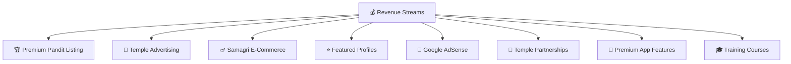
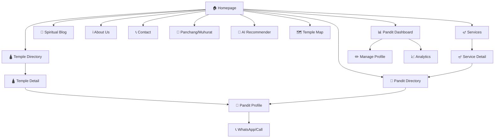

# 📋 PanditConnect — Complete Business & Feature Blueprint

---

## 📊 Part 1: Market Research & Competitor Analysis

### 🏢 Existing Competitors in Market

| Platform | Model | Strengths | Weaknesses |
|----------|-------|-----------|------------|
| **99Pandit** | Booking platform (middleman) | Wide services, live streaming, astrology | Acts as middleman, takes commission, no temple focus, no direct Pandit contact |
| **BookYourPandit** | Booking aggregator | Verified profiles, city-wise | Limited temples, no temple directory, outdated UI |
| **VidhiPujan** | Online/Offline bookings | 300+ ritual types, multi-city | Complex pricing, platform-dependent bookings |
| **Harivara** | Purohit portal | Large database | Poor UX, no temple mapping, old design |
| **VAMA** | Spiritual app | Astrology + Pooja | Subscription-heavy, not Pandit-profile focused |
| **MyPanditG** | Home visit service | Samagri included | Limited to home visits, no temple connection |
| **PrayFullit** | Pooja services | Reviews, ratings | No temple directory, booking-dependent |

### 🔴 Major Gaps in Current Market

| Gap | Problem | Our Solution |
|-----|---------|-------------|
| **No Temple Directory** | Koi bhi platform temples ko properly list/map nahi karta | 🛕 Full temple directory with photos, location, timings, history |
| **Middleman Model** | Sab platforms booking karke commission lete hain | 🤝 **Direct contact** — hum sirf connect karvate hain |
| **No Temple-Pandit Mapping** | Kisi ko pata nahi ki kis mandir pe kaun se Pandit hain | 🗺 Temple ↔ Pandit mapping with availability |
| **Poor Pandit Profiles** | Basic profiles, no video, no detailed specialization | 🎥 Rich profiles with video intro, certificates, reviews |
| **No Muhurat/Calendar** | Users ko khud muhurat dhundhna padta hai | 📅 Built-in **Panchang & Muhurat** calculator |
| **No Community** | Koi community/Q&A nahi hai | 💬 Devotee community forum |
| **Outdated UI/UX** | Most platforms look like 2010 websites | ✨ Modern, Gen-Z friendly, premium design |
| **No Regional Language** | Limited Hindi/English only | 🌐 Multi-language support (12+ Indian languages) |
| **No Trust Verification** | Basic or no verification | ✅ **Video KYC** + certificate verification |
| **No Pooja Guide** | Users don't know which pooja they need | 🤖 AI-powered **Pooja Recommendation Engine** |

---

## 💡 Part 2: Our USP (Unique Selling Proposition)

> **"Hum booking nahi karvate — hum CONNECTION karvate hain"**

### What Makes Us DIFFERENT:

```
┌───────────────────────────────────────────────────────────┐
│                    COMPETITORS                            │
│   User → Platform → Payment → Platform books Pandit       │
│   (Platform = Middleman, takes 20-30% commission)          │
├─────────────────────────────────────────────────────────────┤
│                    PANDITCONNECT                            │
│   User → Search Temple → See Pandit Profiles →             │
│   Direct WhatsApp/Call → User & Pandit decide together      │
│   (NO Middleman, NO commission on service)                  │
└───────────────────────────────────────────────────────────┘
```

### Our Core Value:
1. 🛕 **Temple-First Approach** — Browse by temple, not just by service
2. 🤝 **Direct Connection** — WhatsApp/Call directly, no middleman
3. 🔍 **Transparency** — Full profiles, video intros, verified reviews
4. 📍 **Location-Based** — Find temples & Pandits near you
5. 💰 **No Commission on Services** — Pandits keep 100% of their earnings

---

## 🏗️ Part 3: Advanced Features (Business Level)

### 🔹 Core Features (MVP)

| Feature | Description |
|---------|-------------|
| 🛕 **Temple Directory** | Browse temples by name, city, state with photos, timings, history, Google Maps |
| 🙏 **Pandit Profiles** | Rich profiles: photo, video intro, experience, qualifications, certificates, specializations |
| 📞 **Direct Contact** | WhatsApp, Call, In-app message — no booking through us |
| ⭐ **Ratings & Reviews** | Verified reviews from devotees with photo/video reviews |
| 🔍 **Smart Search** | Search by temple, city, pooja type, language, availability |
| 🪔 **Service Catalog** | 50+ services: Pooja, Havan, Griha Pravesh, Wedding, Mundan, etc. |
| 📍 **Location-Based** | GPS-based nearest temples & Pandits |
| 📱 **Mobile Responsive** | Works perfectly on all devices |

### 🔹 Advanced Features (Competitive Edge)

| Feature | Description | Why It's Unique |
|---------|-------------|-----------------|
| 🤖 **AI Pooja Recommender** | User describes problem/wish → AI suggests which Pooja/Havan to do | No competitor has this |
| 📅 **Panchang & Muhurat** | Built-in Hindu calendar with shubh muhurat for every ritual | Users don't need to search elsewhere |
| 🎥 **Pandit Video Intro** | 60-second video introduction by Pandit | Builds trust, no competitor offers this |
| 📜 **Certificate Verification** | Upload & verify Pandit's Vedic education certificates | Trust & authenticity |
| 🗺️ **Interactive Temple Map** | Full India map with all listed temples, click to explore | Visual, engaging experience |
| 📸 **Temple Virtual Tour** | 360° photos/videos of temples | Immersive experience |
| 📊 **Pandit Dashboard** | Pandits manage their own profile, availability, services | Self-service platform |
| 🔔 **Festival Alerts** | Push notifications for upcoming festivals & auspicious dates | User retention & engagement |
| 💬 **Devotee Community** | Q&A forum, spiritual discussions, experience sharing | Community building |
| 🌐 **Multi-Language** | Hindi, English, Marathi, Tamil, Telugu, Bengali, Gujarati + more | Pan-India reach |
| 📋 **Pooja Samagri List** | Auto-generated list of required items for each Pooja type | Helpful for users |
| 🏆 **Pandit Leaderboard** | Top-rated Pandits featured weekly/monthly | Motivation for quality |
| 📱 **QR Code Profile** | Each Pandit gets a unique QR → scan to see profile | Offline-to-online bridge |
| 🎯 **Smart Matching** | Match users with Pandits based on language, location, specialization | Better experience |
| 📰 **Spiritual Blog** | Articles on rituals, festival significance, Vedic knowledge | SEO + user education |
| 🎧 **Mantra Audio Library** | Collection of mantras with audio/text for each Pooja | Value-added content |

### 🔹 Business Growth Features

| Feature | Description |
|---------|-------------|
| 📈 **Analytics Dashboard** | Track visitors, popular temples, top Pandits, conversion rates |
| 🪔 **Pooja Samagri Store** | E-commerce section to buy pooja items (future monetization) |
| 📹 **Live Darshan** | Live temple camera feeds (partnership with temples) |
| 🤝 **Temple Partnership** | Official partnerships with temple trusts |
| 📧 **Newsletter** | Weekly spiritual newsletter with festival calendar |
| 🎓 **Pandit Training** | Online courses/workshops for Pandits to upskill |

---

## 💰 Part 4: Business Model & Revenue Streams

### Revenue Model (Multi-Stream)



| Stream | Description | Est. Revenue |
|--------|-------------|-------------|
| 🏆 **Premium Pandit Listing** | Pandits pay ₹299-999/month for featured profile, badge, top placement | Primary |
| 🏢 **Temple/Event Ads** | Temples pay to promote events, festivals on platform | Secondary |
| 🪔 **Samagri Store** | Sell pooja items with delivery (commission-based) | Growth |
| ⭐ **Featured Profiles** | Pandits pay for homepage/category top placement | Primary |
| 🎯 **Google AdSense** | Display ads on high-traffic pages (blog, temple pages) | Passive |
| 🤝 **Temple Partnerships** | Official temple listing fees + digital presence setup | B2B |
| 📱 **Freemium Model** | Basic free, premium for advanced search, no ads, priority support | Subscription |
| 🎓 **Training Academy** | Paid online Vedic courses for Pandits | Future |
| 📊 **Data Insights** | Aggregate data reports for temple trusts (anonymized) | B2B |

### Pricing Tiers for Pandits

| Tier | Price | Features |
|------|-------|----------|
| **Free** | ₹0 | Basic profile, 1 temple listing, standard placement |
| **Silver** | ₹299/mo | Verified badge, 5 temples, video intro, priority in search |
| **Gold** | ₹599/mo | All Silver + featured on homepage, analytics dashboard, QR code |
| **Diamond** | ₹999/mo | All Gold + top placement, multiple city listing, premium support |

---

## 🗺 Part 5: Website Sitemap & Page Structure



---

## 🚀 Part 6: Complete Development Prompt

### Full Website Development Prompt

**Project Name:** PanditConnect
**Tagline:** "Sacred Connections, Trusted Pandits"

**Build a premium, modern, responsive multi-page website for "PanditConnect" — a platform that connects devotees with verified Pandits across temples in India. This is NOT a booking platform — it's a DIRECTORY/MARKETPLACE where users can browse temples, view Pandit profiles, and directly contact Pandits via WhatsApp/Call for Pooja, Havan, and ceremony services.**

### Pages to Build:

**1. 🏠 Homepage**
- Hero: Full-width stunning temple image with transparent overlay, search bar (Temple Name, City, Service Type), CTA button
- Stats: Pandits count, Temples count, Cities covered, Happy devotees
- "How It Works" — 3 steps: Search Temple → Choose Pandit → Contact Directly
- Featured Pandits carousel (top-rated)
- Popular Temples grid (6-8 cards)
- Popular Services section
- Testimonials/Reviews slider
- Festival calendar strip (upcoming festivals)
- Download app CTA
- Footer: About, links, social media, contact

**2. 🛕 Temple Directory Page**
- Search bar with filters (City, State, Temple Name)
- Grid of temple cards: photo, name, location, Pandit count, rating
- Sidebar filters: City, State, Service Type, Rating
- Pagination / Infinite scroll
- Map view toggle option

**3. 🛕 Temple Detail Page**
- Large hero image of temple
- Temple info: name, location, timings, history, Google Maps embed
- Tab navigation: Overview, Available Pandits, Services, Reviews, Gallery
- Pandit cards with contact buttons
- Inquiry form sidebar

**4. 🙏 Pandit Directory Page**
- Search & filter (City, Service, Language, Rating, Experience)
- Grid of Pandit profile cards
- Sort by: Rating, Experience, Popularity

**5. 🙏 Pandit Profile Page**
- Profile photo with verified badge, rating, experience
- Video intro section (placeholder)
- Contact: WhatsApp (primary), Call, Message
- Services offered (tags)
- Associated temples list
- Certificates/qualifications
- Reviews from devotees
- Availability calendar
- QR code for sharing
- Languages spoken

**6. 🪔 Services Page**
- Bento grid of all services (30+)
- Each card: icon, name, description, "Find Pandits" button
- Categories: Daily Pooja, Life Events, Festivals, Shanti/Remedy

**7. 🪔 Service Detail Page**
- Service description
- Required Samagri list (auto-generated)
- Estimated duration
- Best muhurat for this service
- Related Pandits who offer this service

**8. 📅 Panchang Page**
- Hindu calendar with tithi, nakshatra, rahu kaal
- Shubh muhurat finder
- Festival dates
- Daily panchang details

**9. 🗺️ Temple Map Page**
- Interactive India map with temple markers
- Click marker → temple info popup
- Filter by state/service

**10. 🤖 AI Pooja Recommender**
- Chat-style interface
- User describes situation/wish
- AI suggests appropriate Pooja/Havan
- Shows relevant Pandits

**11. 📰 Blog / Articles**
- Spiritual articles, festival guides, ritual explanations
- Categories, tags, search
- SEO optimized

**12. 📊 Pandit Dashboard (Login Required)**
- Profile management
- Service & availability management
- Review management
- Analytics (profile views, contact clicks)
- Subscription management

**13. ℹ️ About Us Page**
- Mission, vision, team
- Why PanditConnect (our difference)
- Trust & verification process

**14. 📞 Contact Page**
- Contact form, email, phone
- FAQ accordion
- Social media links

### Design Requirements:
- **Theme:** White + Gold OR White + Bhagva (user selectable)
- **Font:** Poppins (headings) + Inter (body)
- **Style:** Clean, modern, premium — NOT generic
- **Animations:** Subtle micro-animations, smooth transitions
- **Responsive:** Mobile-first, works on all devices
- **Icons:** Custom Hindu-themed icons (Om, Diya, Trishul, Kalash)
- **Images:** Large, high-quality temple/spiritual imagery
- **Accessibility:** WCAG 2.1 compliant

### Tech Stack:
- **Frontend:** HTML, CSS, JavaScript (or React/Next.js)
- **Styling:** Custom CSS with CSS variables for theming
- **Fonts:** Google Fonts (Poppins, Inter)
- **Icons:** Custom SVG + Lucide Icons
- **Maps:** Google Maps API / Leaflet
- **Responsive:** CSS Grid + Flexbox
- **SEO:** Semantic HTML5, meta tags, structured data

---

## 🎯 Part 7: Competitive Advantage Summary

| Us (PanditConnect) | Them (99Pandit, etc.) |
|---------------------|----------------------|
| ✅ Direct contact (WhatsApp/Call) | ❌ Middleman booking |
| ✅ Temple directory with map | ❌ No temple focus |
| ✅ Rich profiles + video | ❌ Basic text profiles |
| ✅ AI Pooja Recommender | ❌ No AI features |
| ✅ Panchang + Muhurat built-in | ❌ No calendar |
| ✅ Modern Gen-Z UI | ❌ Outdated design |
| ✅ Multi-language (12+) | ❌ English/Hindi only |
| ✅ Pandit keeps 100% earnings | ❌ 20-30% commission |
| ✅ Community forum | ❌ No community |
| ✅ Free basic listing | ❌ Paid only |

---

> **Implementation status:** all 14 pages are built (`frontend/public/`). MVP features are live on
> static seed data; AI Recommender ships as a transparent, local rule-matcher (not an LLM call).
> Advanced/growth features not yet built (samagri store, live darshan, training academy,
> mantra audio library) are tracked as backlog — see `docs/ARCHITECTURE.md`.
